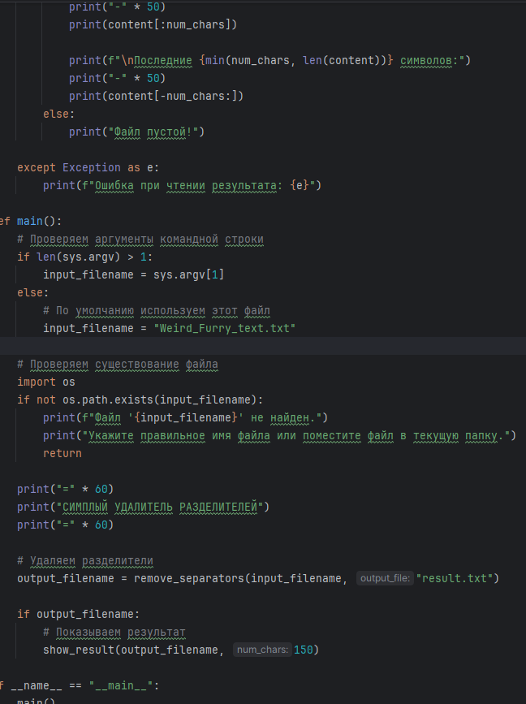
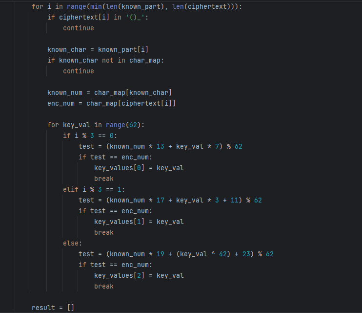
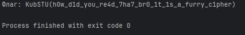

# [crypto] Furry Cipher

> **Category:** `crypto`  
> **CTF:** KubSTU CTF 2026 Spring

---

I was scrolling through my email and saw a message from FurryHater_2009) asking to decrypt some strange message, along with two attached files.

Flag format KubSTU()

[Furry Cipher.zip](./files/Furry Cipher.zip)

---

Solution:
We see a custom encryption algorithm and a large text file full of characters — these are used as padding and need to be removed.

The nickname FurryHater_2009) itself hints at which characters are allowed, namely ( A-z 0-9 _ () ) — this will be our allowed alphabet, meaning the forbidden characters are ( *?&№#"@!=+^\ /|,.<>'" ).

So we remove everything that isn't in our alphabet and get the encrypted flag split into 4 parts. We assemble it and start examining the second file — the algorithm itself.

 

 

 

 

[Solver furry text.py](./files/Solver furry text.py)

After assembling the flag parts, we get a complete but encrypted flag.

We need to repeat the algorithm but invert it.
We find the modular inverses: 13⁻¹=29, 17⁻¹=11, 19⁻¹=23 mod 62.
Using the beginning of the flag KubSTU( as known plaintext, we find the key_values.
We put together a script and get the flag.

 

 

 

[Furry Cipher solve.py](./files/Furry Cipher solve.py)

  

 

Flag: KubSTU(h0w_d1d_you_re4d_7ha7_br0_1t_1s_a_furry_c1pher)

