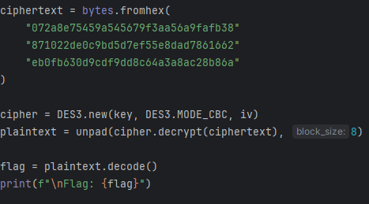

# [crypto] Nintendo 3DS

> **Category:** `crypto`  
> **CTF:** KubSTU CTF 2026 Spring

---

Hey, I can never remember the name of the algorithm, but it's something very similar to Nintendo 3DS — help me figure out what was written there^^
Flag format KubSTU{} 

[output.txt](./files/output.txt)

---

We look at the text file and get the input data, mode, and padding, and from the name we understand that this is Triple DES.

To solve it, we assemble the key (the key is split into 3 fragments in different encodings that need to be assembled) along with the vector (the IV is encrypted with XOR using a mask and needs to be recovered) and try to decrypt.

All the data should be enough to solve it.

 

 

[solve.py](./files/solve.py)

Flag: KubSTU{3d3s_n1nt3nd0_cbc_m0d3_n07_h4rd_3n0ugh}