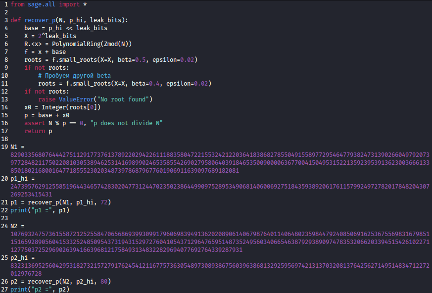

# [crypto] Not enough part 2

> **Category:** `crypto`  
> **CTF:** KubSTU CTF 2026 Spring

---

During an emergency system recovery, only fragments of two ***-keys were saved. From each prime number, only the high bits survived, and the lower bits were ??????. After recovering the private parameters, a master secret was formed from them, which was then converted via KDF into a key for something.
Flag format KubSTU{} 

Hint 1:  Look more carefully — maybe something else survived.

[output.txt](./files/output.txt)

---

So this is the second part of the challenge — let's read the description right away and compare it to the first part. We realize this is a more complex version of RSA+AES-GCM.
(Confirmation of this exact mode is also found in the description: g-recovery, c-only, m-via)

Let's look at the text file — it contains all the data we need to start the recovery (the number of lost bits is hidden in sys info — it's 72 for the first and 80 for the second).

 

Let's write a Sage script that will recover p1 and p2 using Coppersmith's method.

 

[solve.sage](./files/solve.sage)

 

Next, knowing p1 and p2, we find q, phi, and d. Then we try to construct the AES-GCM key, knowing how it's built (by the way, here's another hint — we might need to refer back to the first part of the challenge^^).

 

^^

 

Well then, now that we know everything, let's write the final script.

 

[solve.py](./files/solve.py)

 

The challenge is a bit harder than the first part, but still quite solvable.

Flag: KubSTU{1_h0p3_y0u_solv3d_7hi5_p4rt2_th1s_1s_much_h4rd3r}