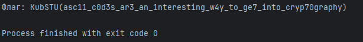

# [crypto] Strange sequence of numbers

> **Category:** `crypto`  
> **CTF:** KubSTU CTF 2026 Spring

---

I received a strange document with numbers inside — what could it mean?
Flag format KubSTU()

[strange_sequence_of_numbers.txt](./files/strange_sequence_of_numbers.txt)

---

Solution:
We see a sequence of numbers that are quite varied, but some of them repeat (for example, the number 99).
This might suggest that each code represents some special character, and all the numbers are separated by spaces.

Let's try decoding them as ASCII codes.

 

 

[Strange sequence of numbers.py](./files/Strange sequence of numbers.py)

Flag: KubSTU(asc11_c0d3s_ar3_an_1nteresting_w4y_to_ge7_into_cryp70graphy)

