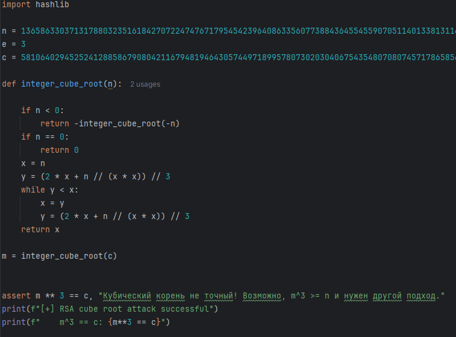

# [crypto] Unlucky 13

> **Category:** `crypto`  
> **CTF:** KubSTU CTF 2026 Spring

---

13 is an unlucky number. Three layers of encryption, thirteen reasons not to try decrypting this. 
Something leaked — hopefully it will help you.
Flag format KubSTU{} 

[Unlucky 13.zip](./files/Unlucky 13.zip)

---

We open encrypt.py and see that the flag is encrypted in three layers, one after another:

1.  XOR with a byte stream from a custom generator cursed_prng(13, ...)
2.  The function forgotten_cipher with a key derived from sha256(b"Unlucky13")
3.  RSA with e = 3

In output.txt we're given only n, e, and c — the result of RSA encryption. To get to the flag, we need to go through all three layers in reverse order: first RSA, then layer 2, then layer 1.

First, RSA

We notice that e = 3. This is a very small public exponent.

RSA works like this: c = m^e mod n, i.e. c = m³ mod n.

But our flag is ~52 bytes (416 bits), and n is 2048 bits. So m³ is approximately 1248 bits, which is still less than n (2048 bits). This means that when cubing, the mod has no effect, and c = m³ is just an ordinary number without any mod.

It's enough to simply extract the cube root of c.

Now RC4

Now we look at the function forgotten_cipher in encrypt.py. It's never called by name, but if you look closely at the code — initializing array S from 0 to 255, shuffling by key, then generating a stream via PRGA — this is RC4.

RC4 is a stream cipher, and it's symmetric, meaning encryption and decryption are the same operation. We run the same data through the same function with the same key.

XOR

The last layer is the simplest. The flag was XORed with a stream from a custom PRNG with seed=13. XOR is symmetric, so we just generate the same stream and XOR again.

 

 

 

[solve.py](./files/solve.py)

Flag: KubSTU{unLucky_13_l4y3r5_0f_encrypt10n_n0_luck_h3r3}