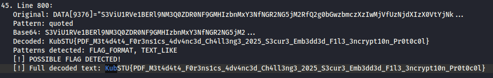

# [forensics] Is the report in English%3F

> **Category:** `forensics`  
> **CTF:** KubSTU CTF 2026 Spring

---

 A strange file arrived by email — a financial report, and in English at that.   

[KUBSTU_Financial_Report_2025.pdf](./files/KUBSTU_Financial_Report_2025.pdf)

                   

1. Using the binwalk command, you can find an embedded archive. The password for it can be found when opening the document itself or by analyzing it with the strings command. The archive contains a fake flag and a meme.

    
2. By analyzing strings, you can see a bunch of base64 strings. You need to write a script that extracts all the strings and decodes them, and we'll get the real flag.

    

      

     

[task.py](./files/task.py)

Flag: KubSTU{PDF_M3t4d4t4_F0r3ns1cs_4dv4nc3d_Ch4ll3ng3_2025_S3cur3_Emb3dd3d_F1l3_3ncrypt10n_Pr0t0c0l}