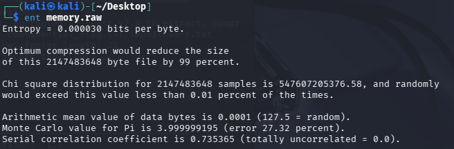
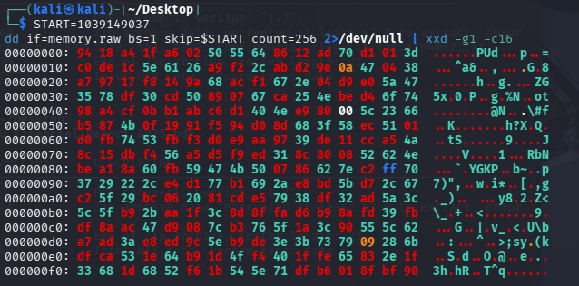
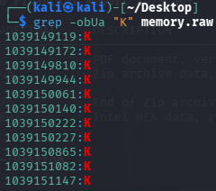

# [forensics] Vanilla raw

> **Category:** `forensics`  
> **CTF:** KubSTU CTF 2026 Spring

---

We received a RAM dump, but for some reason we can't analyze it — help us out.

[memory.rar](./files/memory.rar)

Strings analysis gives us nothing. Grep by pattern also yields nothing. Although the dump is 2 GB, so there must be something in there.
When analyzing entropy and the hex dump, we see:


 


 

We conclude that most of the memory is zeros, but there are non-zero values. Let's find their positions. We craft a script that will trigger on the first non-zero byte.


 

Let's examine the surrounding area.

 

At first glance this doesn't give us anything, but we can notice a possible 4-byte offset. We know the pattern KubSTU{…}. Searching by pattern apparently doesn't make sense, so we need to look character by character. Let's look for the character K.

 

We see that this character is present at several offsets. Let's examine all of them, and at a certain offset the flag pattern starts to emerge.

 

Let's create a script that will fully extract the flag.


 

Flag: 

```javascript
KubSTU{m3m0ry_unl1nk3d_tmpfs_f0r3ns1cs}
```


