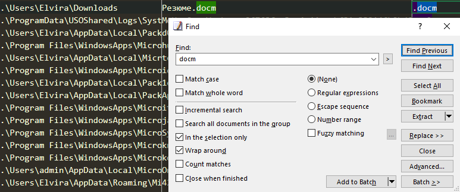
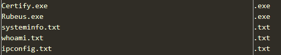
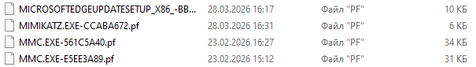
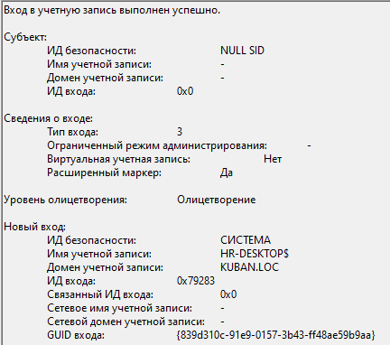
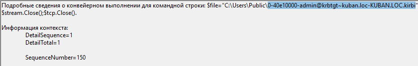
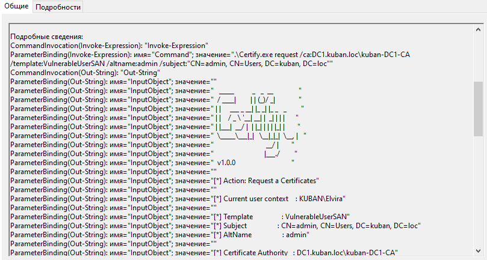
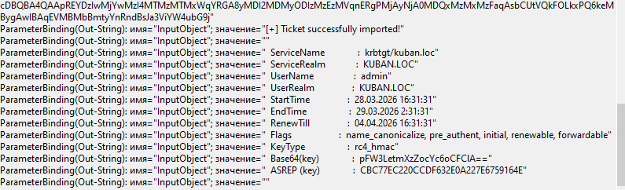
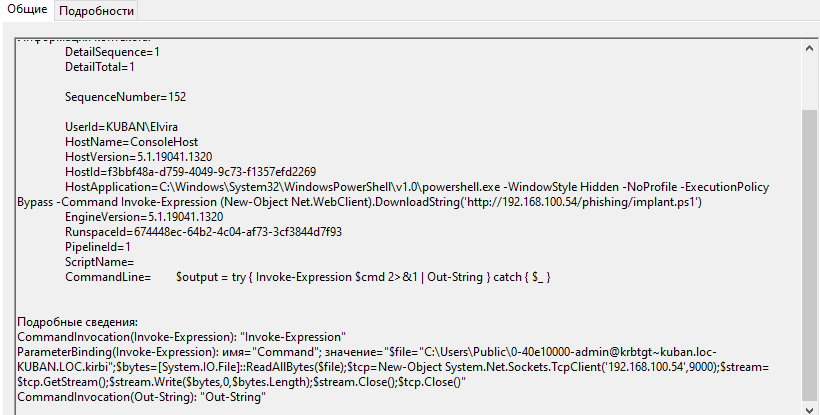
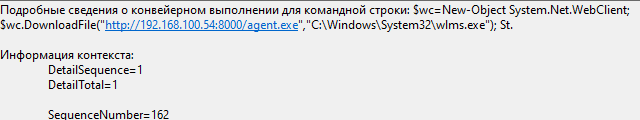
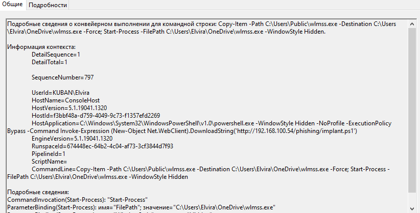

# [forensics] We have an incident!

> **Category:** `forensics`  
> **CTF:** KubSTU CTF 2026 Spring

---

It seems an incident has occurred at our company. Nothing is clear yet — we isolated certain machines just to be safe. The response team is working closely with malware analysts. To make their job easier, you need to provide them with the malware you'll have to find. There are also suspicions that data exfiltration was performed. Find out what happened.

Flag format KubSTU{Vulnerability/attack that led to privilege escalation:List of malware including extensions:Exfiltrated data}

Note! List items in the order of their execution timestamps (case-sensitive), from earliest to latest. Same for exfiltration.

Example: KubSTU{polkit:PwnKit.exe_revershell.exe_WannaCry.exe:ConfidentialData.doc:users.db}


[We have an incident.rar](./files/We have an incident.rar)

Solution: 

We have collected data from machines — from each machine we're provided with artifacts (MFT, Amcache, prefetch, event logs, etc.). 

We begin the analysis. We have no information about what happened, when, or why. Let's look at the MFT (there are many paths you can take — it's your choice).

Throughout this walkthrough I'll be using Eric Zimmerman's toolset. We parse the raw MFT, save it as CSV, and read it. 

We'll see a ton of rows, and among them there might be something useful. The MFT file itself is a table that contains information about all files on the system, including hidden files, their extensions, as well as modification/creation/access timestamps, and so on.

This is the HR machine, so we can assume that work was mainly done with documents. The MFT also has a file extension field.

We can try extensions that could clearly hint that something is off here.

The file Резюме.docm has an extension indicating it may contain macros. The directory tells us the file was probably downloaded — but was it executed? Let's check.

 

The file Резюме.docm has an extension indicating it may contain macros. The directory tells us the file was probably downloaded — but was it executed? Let's check.

Execution can be verified by examining prefetch files. They're created to optimize system performance and contain paths of used resources, as well as a list of files that were accessed. We need to parse them as well, and we can see that it was executed.

 

Let's see what appeared after it in the MFT. A lot of interesting things showed up:

Certify.exe — a tool designed for finding and exploiting misconfigurations in Active Directory Certificate Services (AD CS). 

Rubeus.exe — a tool for working with Kerberos and abusing it. 

Further, we see text files — apparently gathered system information, like initial reconnaissance.  

 

Certify.exe — a tool designed for finding and exploiting misconfigurations in Active Directory Certificate Services (AD CS). 

Rubeus.exe — a tool for working with Kerberos and abusing it. 

Further, we see text files — apparently gathered system information, like initial reconnaissance.  

What else? Let's see what was happening. It's unlikely that this was all the phishing file could do, so let's check the event logs (HR\C\Windows\System32\winevt\logs). By the way, if you've already noticed the Mimikatz prefetch at this stage — good. It will appear a bit lower in the MFT.


 

In the Security log, you can see these events:


 

Logon type — 3, network. Account name: HR. Let's assume the attacker gained access. But we need more details. We have event timestamps, file appearance times, and evidence of their execution. Let's check the Windows PowerShell logs. We see an interesting detail — certain PS commands were executed. This file is what made the attacker establish a reverse shell. We also have the attacker's IP address.


 

There's evidence of Mimikatz being downloaded — after that we'll see events from its execution. Let's keep looking.


 

Further, you can see the exfiltration of a key extracted using Mimikatz.

 

By the way, Mimikatz was not involved in the privilege escalation) — the attempt was made but unsuccessful. However, before the Mimikatz events, we can find Certify's activity. It extracted a private key and a vulnerable certificate VulnerableUserSAN, trying to inject a name into the request. As a result, the name gets substituted in the request. The command:
.\Certify.exe request /ca:DC1.kuban.loc\kuban-DC1-CA /template:VulnerableUserSAN /altname:admin /subject:"CN=admin, CN=Users, DC=kuban, DC=loc". 


 

The attacker then probably copied the data, generated their own key, transferred it to the machine, and implanted it using Rubeus. This can be seen in a couple of events above. Command: .\Rubeus.exe asktgt /user:admin /certificate:C:\Users\Public\admin.pfx /password:"" /nowrap /ptt"


 

We see that the implantation was successful, meaning the attacker achieved privilege escalation. This attack is ESC1. Let's look further. We see an exfiltration attempt, but it was unsuccessful.


 

Now this is interesting — an unknown utility. In reality, it's a Sliver C2 implant.


 

Later, we can see that this file was moved to another directory.


 

That's everything on this machine.

Let's look at the DC machine. This is the domain controller. We examine the PowerShell logs.


 

We see a reverse shell to the attacker's IP. Next, there's something interesting:

 

Copying the AD database. There's also copying of SYSTEM files.

 

A bit further, we see exfiltration of the already copied files. Only ntds.dit was exfiltrated.


 

We construct our flag according to the format.

  

```javascript
KubSTU{ESC1:Резюме.docm_Certify.exe_Rubeus.exe_mimikatz.exe_wlmss.exe:0-40e10000-admin@krbtgt~kuban.loc-KUBAN.LOC.kirbi_ntds.dit}
```


  