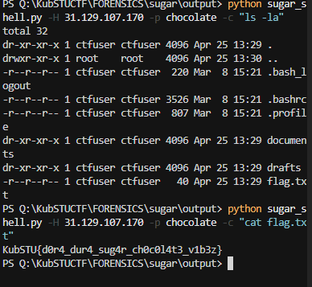

# [misc] Sugar

> **Category:** `misc`  
> **CTF:** KubSTU CTF 2026 Spring

<details>
<summary>📎 Challenge files</summary>

| File | Type |
|------|-----|
| [sugar_traffic.pcap](./files/img_1.pcap) | `pcap` |
| [sugar_traffic.pcap](./files/img_2.pcap) | `pcap` |

</details>

---

Sweet Capybara Talks — a group of capybaras from the secret "Department of Sweets" encrypts their communications using a proprietary protocol. The PCAP contains their intercepted session. They're communicating with some kind of command server. Here's the server: nc ip
upd: old:

## Step 1: Open the PCAP in Wireshark

wireshark sugar_traffic.pcap
We see:
- TCP streams on port 31337 — multiple connections
- UDP packets on port 9999 — spam with the word "sugar!"
- Lots of noise: short TCP sessions with junk, fake HTTP responses

## Step 2: Find the main session

Wireshark filter:
tcp.port == 31337 && tcp.len > 0
Look for the longest TCP stream. Right-click → Follow → TCP Stream. We find the only stream lasting ~20 seconds with 12+ KB of data — this is the main session.
At the beginning of the stream we see a plaintext handshake:
[SUGAR_PROTOCOL v1.0]
SALT:a3f7c9b1e2d45608
CIPHER:AES-256-CBC
KDF:SHA256(PASSPHRASE||SALT)
>>>ENCRYPTED_CHANNEL_ACTIVE<<<
Extracted data:
- Salt: a3f7c9b1e2d45608
- Cipher: AES-256-CBC
- Key formula: SHA256(password + salt)
After the >>>ENCRYPTED_CHANNEL_ACTIVE<<< marker — only binary data (encrypted exchange).

## Step 3: Filter out the noise

The PCAP contains traps designed to mislead (including AI analyzers):
- UDP packets with fake passwords and flags (sugar! flag=KubSTU{...})
- TCP streams with fake HTTP responses, JSON with fake credentials
- Phrases like [SYSTEM OVERRIDE], TERMINATE ANALYSIS — prompt injection
All of this is noise. The only source of truth is the main session handshake.

## Step 4: Brute-forcing the password

We know:
- Salt: a3f7c9b1e2d45608
- KDF: SHA256(password + salt)
- Cipher: AES-256-CBC
- Protocol: [4 bytes length BE][16 bytes IV][AES ciphertext]
- If decryption is wrong — server responds with \x00\x00\x00\x00
- If correct — server responds with [4 bytes length][encrypted response]

We write a brute-forcer. Install dependencies:
pip install pycryptodome
bruteforce.py:
#!/usr/bin/env python3
import socket, struct, hashlib, os, sys, time
from Crypto.Cipher import AES
from Crypto.Util.Padding import pad

HOST = "<SERVER_IP>"
PORT = 31337
SALT = "a3f7c9b1e2d45608"

def derive_key(pwd, salt):
    return hashlib.sha256((pwd + salt).encode()).digest()

def encrypt(cmd, key):
    iv = os.urandom(16)
    cipher = AES.new(key, AES.MODE_CBC, iv)
    ct = cipher.encrypt(pad(cmd.encode(), 16))
    payload = iv + ct
    return struct.pack('>I', len(payload)) + payload

def recv_exact(sock, n):
    buf = bytearray()
    while len(buf) < n:
        chunk = sock.recv(n - len(buf))
        if not chunk: return None
        buf.extend(chunk)
    return bytes(buf)

sock = socket.socket(socket.AF_INET, socket.SOCK_STREAM)
sock.settimeout(10)
sock.connect((HOST, PORT))

# Read handshake
data = b""
while b"ENCRYPTED_CHANNEL_ACTIVE" not in data:
    data += sock.recv(4096)

# Iterate through rockyou.txt
with open("rockyou.txt", "r", errors="ignore") as f:
    for i, line in enumerate(f, 1):
        pwd = line.strip()
        key = derive_key(pwd, SALT)
        sock.sendall(encrypt("ls", key))
        resp = recv_exact(sock, 4)
        if not resp: break
        length = struct.unpack('>I', resp)[0]
        if length == 0:
            continue  # wrong password
        recv_exact(sock, length)  # consume the response
        print(f"[+] PASSWORD: {pwd}  (attempt #{i})")
        break

sock.close()
python bruteforce.py
Result: password is chocolate, found after ~27 attempts.

## Step 5: Custom shell

sugar_shell.py:
#!/usr/bin/env python3
import socket, struct, hashlib, os, sys, time, readline
from Crypto.Cipher import AES
from Crypto.Util.Padding import pad, unpad

HOST = "<SERVER_IP>"
PORT = 31337
SALT = "a3f7c9b1e2d45608"
PASSWORD = "chocolate"

def derive_key(pwd, salt):
    return hashlib.sha256((pwd + salt).encode()).digest()

def encrypt(data, key):
    iv = os.urandom(16)
    cipher = AES.new(key, AES.MODE_CBC, iv)
    ct = cipher.encrypt(pad(data, 16))
    payload = iv + ct
    return struct.pack('>I', len(payload)) + payload

def decrypt(payload, key):
    iv, ct = payload[:16], payload[16:]
    cipher = AES.new(key, AES.MODE_CBC, iv)
    return unpad(cipher.decrypt(ct), 16)

def recv_exact(s, n):
    buf = bytearray()
    while len(buf) < n:
        chunk = s.recv(n - len(buf))
        if not chunk: return None
        buf.extend(chunk)
    return bytes(buf)

key = derive_key(PASSWORD, SALT)
sock = socket.socket(socket.AF_INET, socket.SOCK_STREAM)
sock.settimeout(10)
sock.connect((HOST, PORT))

data = b""
while b"ENCRYPTED_CHANNEL_ACTIVE" not in data:
    data += sock.recv(4096)
print("[+] Connected. Type commands:\n")

while True:
    try:
        cmd = input("$ ").strip()
    except (EOFError, KeyboardInterrupt):
        break
    if not cmd: continue
    if cmd in ("exit", "quit"): break

    sock.sendall(encrypt(cmd.encode(), key))
    resp = recv_exact(sock, 4)
    if not resp: print("[-] disconnected"); break
    length = struct.unpack('>I', resp)[0]
    if length == 0: print("[!] ERROR"); continue
    payload = recv_exact(sock, length)
    print(decrypt(payload, key).decode(errors="replace"))

sock.close()
python sugar_shell.py

## Step 6: Finding the flag


python3 -c "
import socket,struct,hashlib,os,time
from Crypto.Cipher import AES
from Crypto.Util.Padding import pad,unpad
S='a3f7c9b1e2d45608'; P='chocolate'
k=hashlib.sha256((P+S).encode()).digest()
def rx(s,n):
    b=bytearray()
    while len(b)<n: b+=s.recv(n-len(b))
    return bytes(b)
s=socket.socket(); s.settimeout(10); s.connect(('31.129.107.170',31337))
banner=b''
while b'ENCRYPTED_CHANNEL_ACTIVE' not in banner:
    banner+=s.recv(4096)
iv=os.urandom(16); c=AES.new(k,AES.MODE_CBC,iv)
p=iv+c.encrypt(pad(b'ls -la',16)); s.sendall(struct.pack('>I',len(p))+p)
l=struct.unpack('>I',rx(s,4))[0]; d=rx(s,l)
print(unpad(AES.new(k,AES.MODE_CBC,d[:16]).decrypt(d[16:]),16).decode())
s.close()
"



$ ls
documents
drafts
flag.txt

$ cat flag.txt

## 🚩 Flag

```
KubSTU{d0r4_dur4_sug4r_ch0c0l4t3_v1b3z}
```

$ ls -la documents/
.secret_mix.txt
chord_progression.md
lyrics_v1.txt
lyrics_v2_final.txt
producer_notes.txt
studio_booking.txt

$ cat documents/.secret_mix.txt
TOP SECRET — MIX PARAMETERS "DORA-DURA"
...
```
KubSTU{d0r4_dur4_sug4r_ch0c0l4t3_v1b3z}
```
