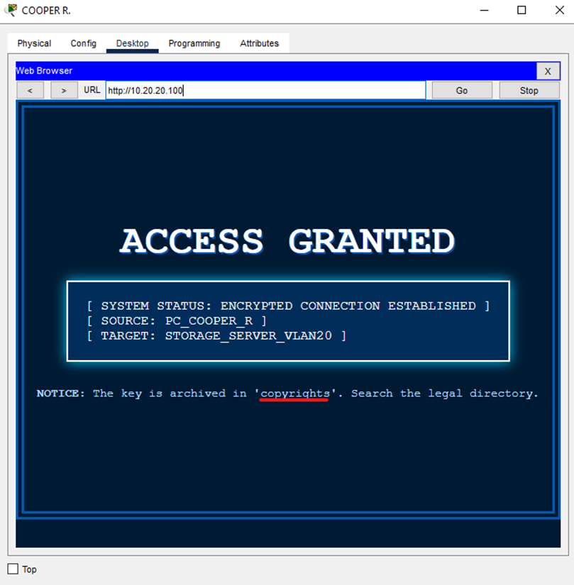

# [network] Nut legends

> **Category:** `network`  
> **CTF:** KubSTU CTF 2026 Spring

---

         

[LightA.pkt](./files/LightA.pkt)

          

A network topology anomaly has been detected. Direct access to the target node is blocked at multiple OSI model layers. You are given an entry point (PC Cooper R.) and a single artifact — an image file. Restore the access chain and retrieve the flag.

    Writeup

We see that for some reason the server doesn't respond to ping, even though the cable is plugged in.

- **Analysis:**      The show vlan brief command on the switch shows that the server is on      port Fa0/10 (VLAN 1), but it should be in **VLAN 20** (port Fa0/2).
- **Solution:**      Move the server cable to port **Fa0/2**. Now the server is in      its proper logical segment.
- Alt. Solution: Reconfigure the VLAN assignment for the connected port.

Once we see that ping from the PC to the server is going through, we open the web browser from the PC.

 

 

 

 

Flag: kubstu(end_user_license_agreement)