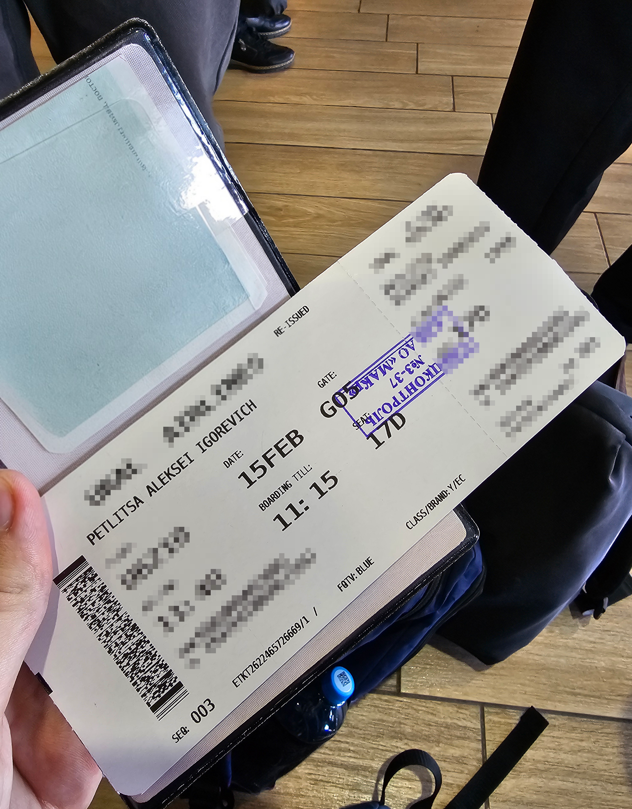

# [osint] Bad OpSec

> **Category:** `osint`  
> **CTF:** KubSTU CTF 2026 Spring

Difficulty: medium  

A friend of mine watched too many hacker movies and is trying to be just as secretive. Let's show him that it's not working. Find the flight number he arrived on and at what time.

Flag format: `KubSTU{Flight_City_Arrival:Time}`

---

A friend of mine watched too many hacker movies and is trying to be just as secretive. Let's show him that it's not working. Find the flight number he arrived on and at what time.

Flag format: `KubSTU{Flight_City_Arrival:Time}`

 

---

## **What We're Left With**

At first glance it seems like there's zero useful information, but if you look more carefully, we still have:

- date
- boarding end time
- gate number
- seat number
- and most importantly — **the barcode**

---

## **Step 1. Identifying the Barcode Type**

First, a bit of theory.
If you Google what barcodes are typically used on boarding passes, you'll quickly find out it's **PDF417**.

This is confirmed both by appearance and by articles:

- Habr: <https://habr.com/ru/companies/panda/articles/270029/>
- Habr: <https://habr.com/ru/articles/578392/>
- Reddit: <https://www.reddit.com/r/airportceo/comments/6xvyl5/barcodes_on_boarding_passes/?tl=ru>

   

So the task now boils down to a very simple question:
**how do we decode it?**

---

## **Step 2. Decoding PDF417**

We look for any online PDF417 scanner.
I used this one: <https://demo.dynamsoft.com/barcode-reader/>

We upload the image — and get this string:

M1PETLITSA/ALEKSEI IGOE93KTGB KRRSVXU6 0210 046Y017D0003 151>2180OO6046B 29262 0 U6 1003750527 0776298473

At first glance it looks like gibberish, but in reality almost the entire answer is already here.

---

## **Step 3. Extracting the Route and Flight**

The first thing that catches the eye is the fragment:

KRRSVX

This is not a random set of characters, but **two IATA airport codes in a row**:

- **KRR** — Krasnodar
- **SVX** — Yekaterinburg

So the route is:
**Krasnodar → Yekaterinburg**

Next, we look at:
U6 0210

This is the **flight number**:

- **U6** — airline code for *Ural Airlines*
- **0210** → flight **U6 210**

At this point we can confidently say:

> this is **Ural Airlines flight U6 210** from **Krasnodar to Yekaterinburg**.
>
>  

---

## **Step 4. Finding the Actual Arrival Time**

Now all that's left is to nail the second part of the task — **when did he land**.

We already have:

- flight number: **U6 210**
- route: **KRR → SVX**
- date from the boarding pass

With this information, we head to **FlightAware** and search for the flight.

👉 <https://www.flightaware.com/>

We find flight **U6 210**, open the flight history, and look at the flight for **February 15** (the date from the pass).
There we can see the actual arrival time in Yekaterinburg.

**Final local arrival time: 21:39**

 

---

## **Flag**

We assemble everything according to the task format:

- FlightNumber → `U6-210`

- City → `Ekaterinburg`

- LocalTime → `21:39`

### **Flag:**

`KubSTU{U6210_Ekaterinburg_21:39}`

  

