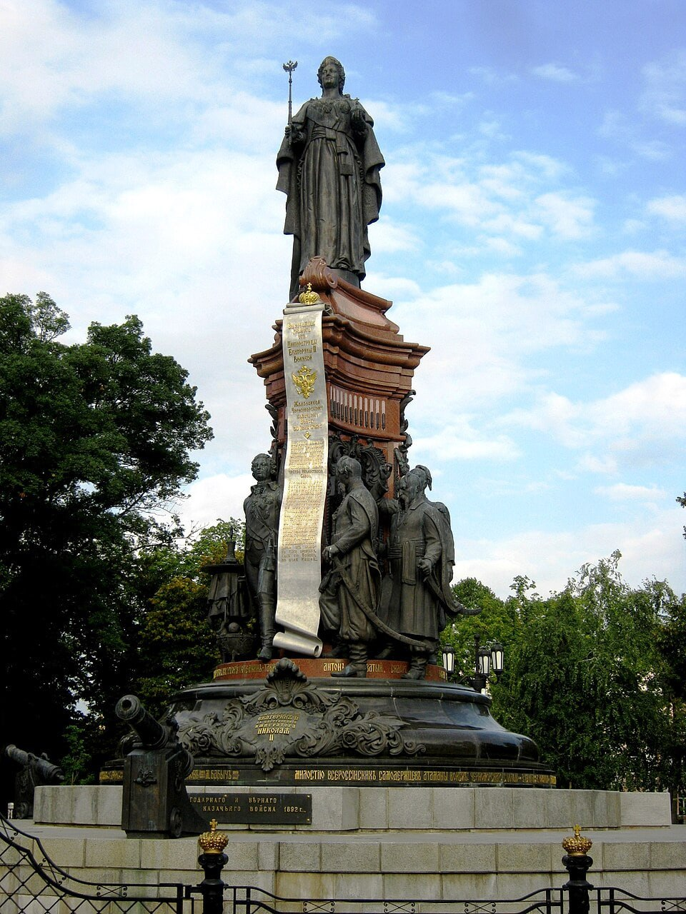

# [osint] Founder

> **Category:** `osint`  
> **CTF:** KubSTU CTF 2026 Spring

**Description:**

The Founder (photo of the monument in question) Challenge: In the center of Krasnodar stands a beautiful monument. At its base, you can spot three atamans. Who do you think is the "main" one? 

**Flag format:** `KUBSTU{FirstName_LastName}` 

**Hint:** read up on the history... (or something like that)    

**Answer:** `KUBSTU{Zakhariy_Chepega}`

 

