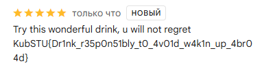
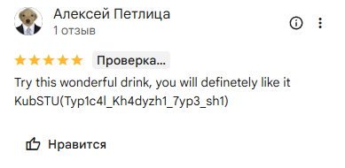

# [osint] Legendary pull

> **Category:** `osint`  
> **CTF:** KubSTU CTF 2026 Spring

<details>
<summary>📎 Challenge files</summary>

| File | Type |
|------|-----|
| [Passo Campalto Orlanda_Хадыжи _И.mp4](./files/img_3.mp4) | `video/mp4` |

</details>

---

Difficulty: hard

I have too many questions about this situation and no answers. Find the message from the Kuban tourist.

1. Initial visual analysis

First, we analyze the photograph itself:
- building architecture,
- neat fences and landscaping,
- road markings,
- style of urban infrastructure,
- appearance of the bus stop.

Based on the combination of features, the location doesn't look like Krasnodar, or Russia in general. This immediately suggests that the Khadyzhenskoye beer sticker is not pointing to the country, but is simply a meme.

The most noticeable clue in the photo is the round "Khadyzhenskoye" sticker.

2. Determining the likely country

To avoid guessing blindly, you can:
- upload the photo to a visual neural network / image recognition,
- use reverse image / visual search,
- ask a model to determine the most likely country based on architecture and infrastructure.

The prompt I used: "find all possible geo-references and determine the country/city where the photo was taken"

The most plausible result — Italy.

After this, we have two main clues:
- Khadyzhenskoye beer
- Italy as the likely country

3. Analyzing the challenge name

The task name is Mythical Pull.

There's a reference here to the popular meme/reels format "Reel Pull", where "pull" means "rare find", "unexpected catch", "strange drop", often with absurd or very niche content.

So the hint is not just about photo geolocation, but that this is a frame from a reel that can be found by association.

4. Keyword search

Next, we search not for the street itself, but for content related to this phenomenon.
Useful queries:
- Хадыженское Италия
- Хадыжи Италия
- Хадыженское в Италии
- Khadyzhenskoe Italy
- Khadyzhenskoe beer Italy
- Hadizhenskoe Italy meme
- Italian bus stop Khadyzhenskoe

It makes sense to search:
- on Google,
- on Instagram,
- on TikTok,
- using both English and Russian variants.

5. Finding the original video

If the search is done correctly, it leads to an Instagram Reel:
Source: https://www.instagram.com/reel/DV9U0fZkSnG/

In this video, the author shows the exact location and explains where the pole with the sticker is.

6. Determining the exact location

From the reel, we get the point:
Bus stop Passo Campalto Orlanda

Then:
- open it on a map,
- compare the surroundings with the photo,
- confirm that:
  - the pole shape matches,
  - there's a bus shelter nearby,
  - the road surroundings and buildings visually match.

7. Getting the flag

After confirming the location, we go further:
- open the stop / POI on maps,
- check comments / reviews / photos,
- the flag is found there.



Format per the challenge:

## 🚩 Flag

```
KubSTU{Dr1nk_r35p0n51bly_t0_4v01d_w4k1n_up_4br04d}
```


