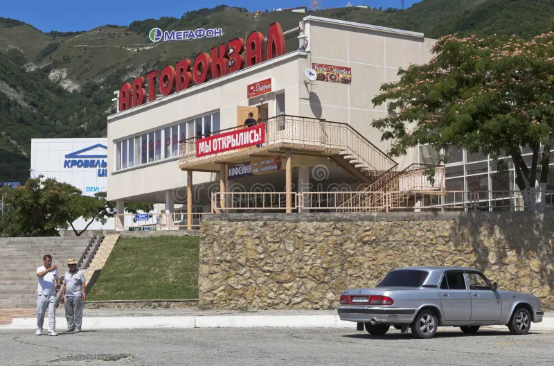
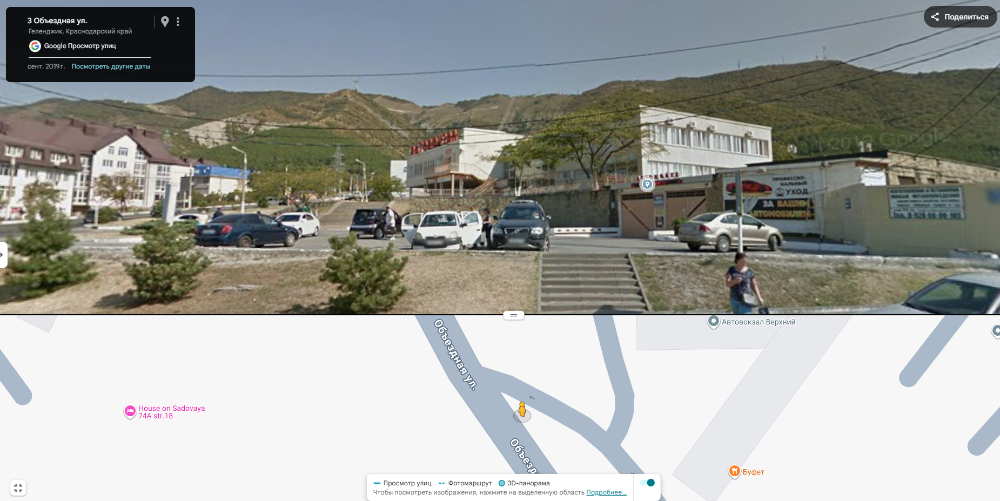

# [osint] Morning without coordinates

> **Category:** `osint`  
> **CTF:** KubSTU CTF 2026 Spring

Difficulty: medium

Exams are over — a rare moment to take a breather.
In the evening, we decided to celebrate the end of exams and, as often happens, slightly overestimated our abilities.

In the morning, it turned out that one of our group was missing. The last thing everyone remembers is that we were somewhere on Krasnoarmeyskaya Street. After that — blackout.

In the afternoon, the missing person gets in touch and sends a photo with a message:

 

*"Seems like I'm fine. Smells like the sea, no idea where I am. Send me some money — I'll try to get home."*

The phone is on its last breath, GPS is jammed, and everyone's head is still heavy.

All hope rests on you — the only one who kept a clear mind.
**Determine the city and exact address where the photo was taken.**

Flag format - `KubSTU{CityName_StreetName_BuildingNumber}`

---

## **Determining the Search Area**

We start with the simplest thing — **carefully looking at the photo** and recalling the details from the story.

According to the scenario, we're still in **Krasnodar Krai**, plus the missing person's message has a big hint:

> *"Smells like the sea"*

And in the background of the photo, **mountains** are clearly visible. In Krasnodar Krai, this significantly narrows the search area:
mountains + sea = coastline.

Effectively, the strip from **Sochi to Novorossiysk** remains.

---

## **Finding the City**

Next, we move to the details in the photo itself. In the background, a large building with distinctive architecture and a sign is clearly visible — it looks like a **bus station**.
This is already a great lead because:

- there aren't that many bus stations,
- they often have photos available in public sources.

We try a simple and logical approach:
pick the largest cities and Google queries like

> bus station <city>

and look at photos.

For the query **"bus station Gelendzhik"**, we quickly find a building that **completely matches** what's visible in the photo: shape, number of floors, facade — everything is identical.

 

---

## **The Missing Person is Found**

Now that the city is identified, all that's left is to determine the **exact shooting location**.

We open maps, find the **Gelendzhik bus station**, and enable panorama mode.
Then — a bit of patience: we look around, move along the road, check bus stops and viewing angles.

Eventually, we find the spot:

- a bus stop across from the bus station,
- the angle matches the photo,
- the position of buildings and the road aligns

 

 

---

## Hooray, the Finale

Flag - `KubSTU{Gelendzhik_Obezdnaya_3}` 
(When writing the flag, we ignore the hard sign)

