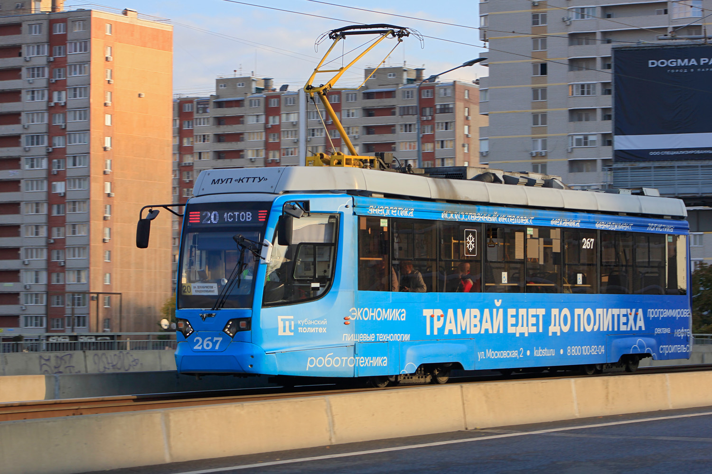

# [stego] Krasnodar tram

> **Category:** `stego`  
> **CTF:** KubSTU CTF 2026 Spring

---

I really love the trams in Krasnodar. They're very convenient, fast, and affordable. Soak up the tram vibes and find my message.

We start solving by examining the metadata.
(exiftool output for both 267.jpg and 678.jpg is shown with various base64 fragments hidden in EXIF fields)

In the metadata of both photos, you can see 4-character blocks ending with =. We can assume these all belong to a single base64 string. We extract all blocks and ask a neural network to play around with them and find a working string.

(First script produces the result: //kps:httubstu.69s-1ru/s-1ps:tu.ru///kubshttps:httubs//kru/tu.69s-1)

You can also use an additional script that tries to find a valid link in the resulting string.

If you look closely at the string, you can see https:, //kubs, tu.ru, s-1, 69. Putting it all together we get https://kubstu.ru/s-169. Following the link, we see the page of our wonderful Cybersecurity and Information Protection department. Then we conclude we've ended up in the wrong place.

We go back to the metadata examination step and notice there are more similar-looking blocks in a different format: iso=200|Q3N2, wb=135|b20v. Again we go through the metadata, gather all blocks, and start playing with them to find a working link.

(Second script with permutations of decoded blocks)

Script output:
=== Decoded blocks ===
From 267.jpg: b20v -> 'om/' ZWJp -> 'ebi' Q3N2 -> 'Csv' Ly9w -> '//p' aHR0 -> 'htt'
From 678.jpg: cHM6 -> 'ps:' YXN0 -> 'ast' U3VC -> 'SuB' bi5j -> 'n.c' cEs= -> 'pK'

From this we conclude there's https://, the domain starts with p and likely ends with n.com/ => we can assume it's a link to pastebin.com.

Based on this, we then search for the exact paste address using a permutation script.

After a couple minutes of script execution, we get the target link https://pastebin.com/raw/SuBCsvpK and the flag — KubSTU{g0d_s4v3_7h3_kr45n0d4r_7r4m}

Challenge solved!
