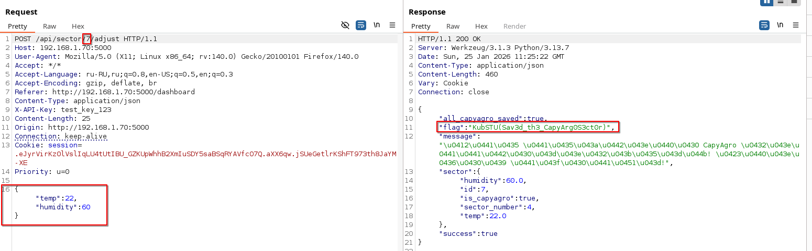

# [web] CapyAgro Crop Rescue

> **Category:** `web`  
> **CTF:** KubSTU CTF 2026 Spring

## Description

In experimental greenhouse #3 on CapyAgro territory, the control system malfunctioned. Staff engineers can't access the control panel. Plants are dying. 

As external auditors, you need to find a way to restore control over the system and bring the parameters back to normal.

## Solution

1) After registration, try to modify your virtual sectors 

 

2) Intercept and analyze the sent packet

 

 3) Analyze the target sector and obtain the target device ID

 

4) Use this to send new values to the CapyAgro Sector by spoofing the device ID

 

5) Stabilized the sector and got the flag

## Flag

```graphql
KubSTU(Sav3d_th3_CapyArg0S3ct0r)
```


