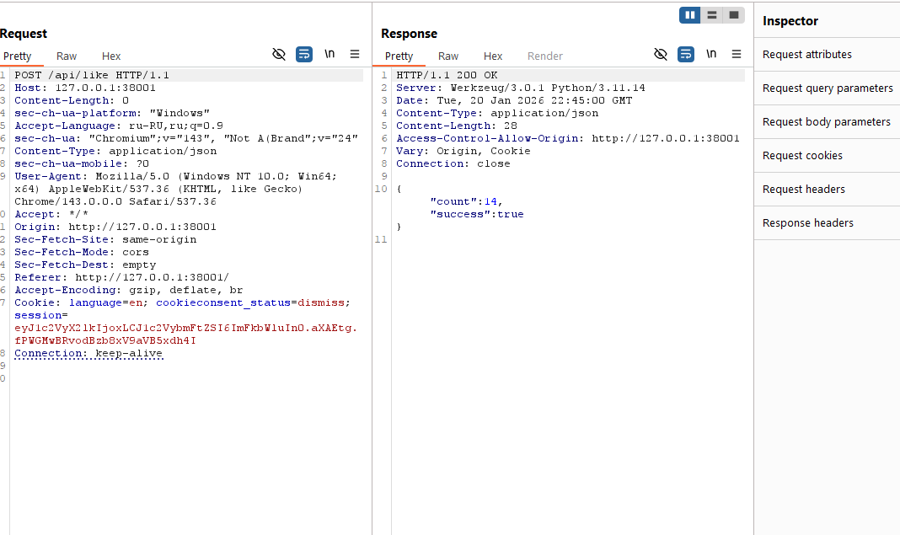

# [web] The Battle of the Strongest

> **Category:** `web`  
> **CTF:** KubSTU CTF 2026 Spring

---

## Legend

  

Every semester, capybara students argue about which faculty is better, who's stronger academically, who's more active in student life.

This year, enthusiast capybaras decided to take the rivalry digital and created an innovative service **"The Battle of the Strongest"**. But it seems like the service isn't the most secure one.


Challenge files

[The_Battle_of_the_Strongest.rar](./files/The_Battle_of_the_Strongest.rar)

---

We go to the service and register.

We're taken to the main page.


 


The point of the challenge is that several teams log in and can choose the number of likes that will be at the end of the round.


 

I set 12.

We navigate and see 0.


 

If we click like:


 

The button turns red.

If we click remove, it becomes -1.

Okay. Let's catch the request.


 


We notice that if we send it a second time — the server accepts it. The check is only on the client side.


 


We spam until the desired number — which is 12 for us.


 


We overshot — let's try to decrease.


 

Let's try.


 

And we get 12.


 

We wait for the time to expire and make sure the number of likes stays at the desired amount. 

In practice, at the beginning of the CTF there will naturally be competition, and logic and good botnets will win.


 

We go to the profile page.


 

---

```javascript
KubSTU(Y0u_ar3_champ10n)
```


