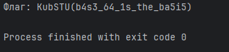

# [crypto] Base

> **श्रेणी:** `crypto`  
> **CTF:** KubSTU CTF 2026 Spring

---

हमने एक अजीब संदेश इंटरसेप्ट किया। ऐसा लगता है कि इसे एक लोकप्रिय विधि से एन्कोड किया गया है। यह समझने में मदद करो कि इसमें क्या लिखा है।  
फ़्लैग का प्रारूप KubSTU()

[Base.txt](./files/Base.txt)

---

समाधान:
स्ट्रिंग की संरचना और चुनौती का नाम ही स्पष्ट रूप से बता रहा है कि यह base एन्कोडिंग है, बस इसके विभिन्न प्रकारों को आज़माना बाकी है।
केवल base64 ही मान्य साबित होता है

 

 

[Base.py](./files/Base.py)

फ़्लैग: KubSTU(b4s3_64_1s_the_ba5i5)

