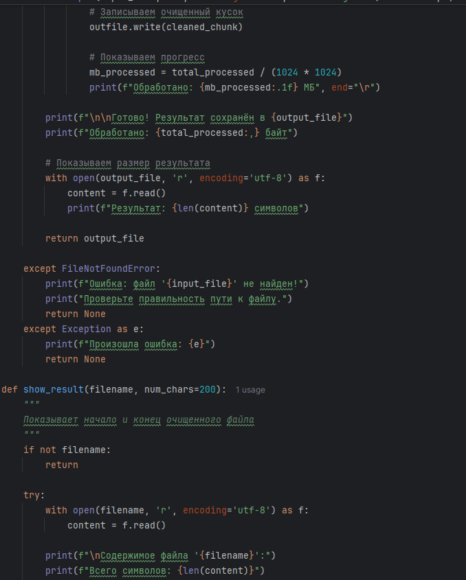

# [crypto] Furry Cipher

> **श्रेणी:** `crypto`  
> **CTF:** KubSTU CTF 2026 Spring

---

अपनी मेल ब्राउज़ कर रहा था और FurryHater_2009) से एक पत्र देखा जिसमें किसी अजीब संदेश को डिक्रिप्ट करने का अनुरोध था, साथ ही उसने दो फ़ाइलें भी अटैच की थीं।

फ़्लैग का प्रारूप KubSTU()

[Furry Cipher.zip](./files/Furry Cipher.zip)

---

समाधान:
हम एक कस्टम एन्क्रिप्शन एल्गोरिथ्म और एक बड़ी टेक्स्ट फ़ाइल देखते हैं जिसमें ढेर सारे प्रतीक हैं
ये प्लेसहोल्डर के रूप में उपयोग किए गए हैं - इन्हें हटाना होगा

निक FurryHater_2009) ही हमें बताता है कि कौन से प्रतीक अनुमत हैं, यानी( A-z 0-9 _ () ) यह हमारा अनुमत अक्षरमाला होगा, तो प्रतिबंधित में शामिल हैं ( *?&№#"@!=+^\ /|,.<>'" )

इसका मतलब है कि जो हमारे अक्षरमाला में नहीं है उसे हटा दें और 4 भागों में विभाजित एन्क्रिप्टेड फ़्लैग प्राप्त करें, इसे इकट्ठा करें और दूसरी फ़ाइल - स्वयं एल्गोरिथ्म - को देखना शुरू करें

 

 

 

 

[Solver furry text.py](./files/Solver furry text.py)

फ़्लैग के भागों को इकट्ठा करने के बाद हमें एक पूर्ण लेकिन एन्क्रिप्टेड फ़्लैग मिलता है

हमें एल्गोरिथ्म को उलट कर दोहराना होगा
व्युत्क्रम तत्व ज्ञात करें: 13⁻¹=29, 17⁻¹=11, 19⁻¹=23 मॉड्यूलो 62 पर
फ़्लैग की शुरुआत KubSTU( को known plaintext के रूप में उपयोग करके key_values ज्ञात करें
स्क्रिप्ट बनाएँ और फ़्लैग प्राप्त करें

 

 

 

[Furry Cipher solve.py](./files/Furry Cipher solve.py)

  

 

फ़्लैग: KubSTU(h0w_d1d_you_re4d_7ha7_br0_1t_1s_a_furry_c1pher)

