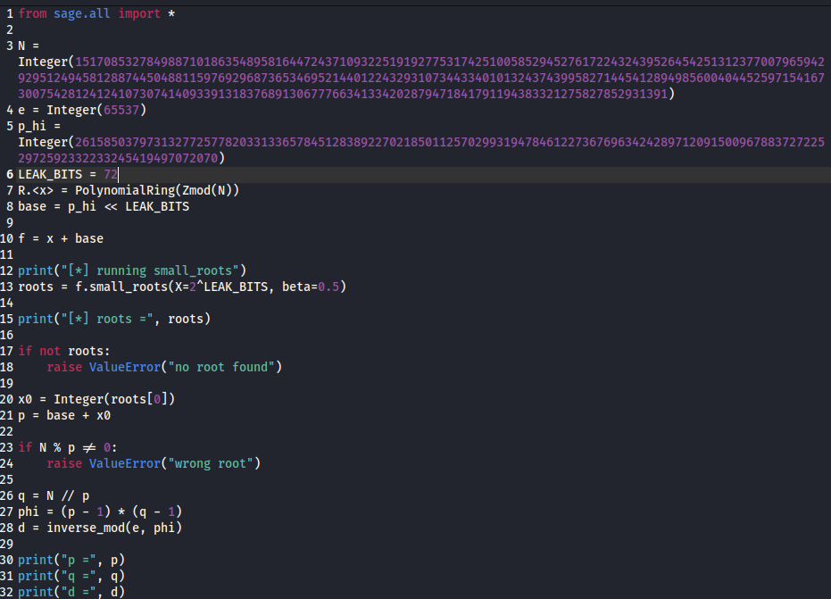

# [crypto] Not enough part 1

> **श्रेणी:** `crypto`  
> **CTF:** KubSTU CTF 2026 Spring

---

सिस्टम डंप के दौरान कुछ पैरामीटर क्षतिग्रस्त हो गए: p के केवल कुछ बिट्स ही बचे, अंतिम 72 बिट्स खो गए। फिर पुनर्स्थापित पैरामीटर से सीक्रेट को हैश करके कुंजी प्राप्त की गई (यह शायद AES-GCM है?)
फ़्लैग का प्रारूप KubSTU{}  

[output.txt](./files/output.txt)

---

हमारे सामने RSA-स्कीम है: N, e और सिफरटेक्स्ट दिए गए हैं। तुरंत ध्यान में आया कि पूर्ण अभाज्य संख्या p के बजाय केवल उसका उपसर्ग p_hi दिया गया है। शर्त से पता चलता है कि p के अंतिम 72 बिट्स खो गए हैं, यानी संख्या को p = p_hi · 2^72 + x के रूप में दर्शाया जा सकता है, जहाँ अज्ञात x — अपेक्षाकृत छोटा है।

Sage में मॉड्यूलो N पर एक बहुपद बनाया गया, जिसके बाद small_roots() की सहायता से p के लुप्त भाग को पुनर्स्थापित करना संभव हुआ। जब अभाज्य संख्या मिल गई, तो दूसरा अभाज्य q = N / p निकालना बाकी रहा, फिर ऑयलर फंक्शन phi = (p - 1)(q - 1) को पुनर्स्थापित करना और निजी एक्सपोनेंट d = e^{-1} mod phi ज्ञात करना था।  

 

 

[solve.sage](./files/solve.sage)

यहाँ RSA केवल एक मध्यवर्ती चरण के रूप में उपयोग किया गया है। d से sha256(long_to_bytes(d)) (शर्त से) के माध्यम से AES-GCM के लिए कुंजी प्राप्त की गई, जिसके द्वारा फ़्लैग एन्क्रिप्ट किया गया था। d को पुनर्स्थापित करने के बाद, बस कुंजी की गणना करना, दिए गए nonce, ciphertext और tag के साथ AES-GCM को इनिशियलाइज़ करना और मूल संदेश प्राप्त करना बाकी था।  

 

 

[solve.py](./files/solve.py)

फ़्लैग: KubSTU{1_h0p3_y0u_solv3d_7hi5_wi7h0ut_4ny_pr0bl3m5}

