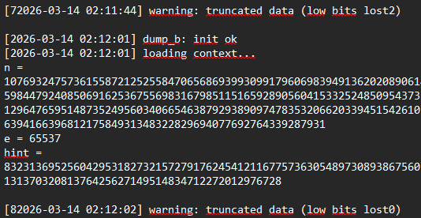
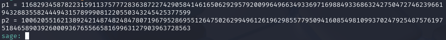
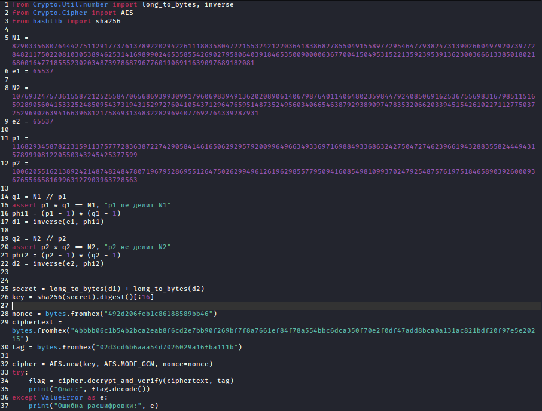

# [crypto] Not enough part 2

> **श्रेणी:** `crypto`  
> **CTF:** KubSTU CTF 2026 Spring

---

आपातकालीन सिस्टम पुनर्स्थापना के दौरान दो ***-कुंजियों के केवल अंश ही सहेजे गए। प्रत्येक अभाज्य संख्या के केवल उच्च बिट्स बचे, और निचले बिट्स ?????? हो गए। निजी पैरामीटर पुनर्स्थापित करने के बाद उनसे एक मास्टर-सीक्रेट बनाया गया, जिसे फिर KDF के माध्यम से किसी चीज़ के लिए कुंजी में बदला गया।
फ़्लैग का प्रारूप KubSTU{} 

संकेत 1:  ध्यान से देखो, शायद कुछ और बच गया हो।

[output.txt](./files/output.txt)

---

तो, यह चुनौती का दूसरा भाग है, तुरंत विवरण पढ़ते हैं और पहले भाग से तुलना करते हैं। समझ आता है कि यह RSA+AES-GCM का कठिन संस्करण है
(इस मोड की पुष्टि विवरण में भी मिलती है: g-восстановления, c-только, m-через)

टेक्स्ट फ़ाइल में देखते हैं, वहाँ पुनर्स्थापना शुरू करने के लिए आवश्यक सभी डेटा है( खोए हुए बिट्स की संख्या sys info में छिपी है - यह पहले के लिए 72 और दूसरे के लिए 80 है)

 

कॉपरस्मिथ विधि का उपयोग करके p1 और p2 को पुनर्स्थापित करने के लिए Sage स्क्रिप्ट लिखते हैं  

 

[solve.sage](./files/solve.sage)

 

आगे, p1 और p2 जानते हुए, q, phi और d ज्ञात करते हैं। फिर AES-GCM के लिए कुंजी बनाने का प्रयास करते हैं, यह जानते हुए कि यह कैसे बनी है (वैसे, यहाँ एक और संकेत है, हमें पहले भाग की थोड़ी मदद लेनी पड़ सकती है^^)

 

^^

 

ठीक है, अब सब कुछ जानते हुए, अंतिम स्क्रिप्ट लिखते हैं

 

[solve.py](./files/solve.py)

 

चुनौती पहले भाग से थोड़ी कठिन है, लेकिन फिर भी हल करने योग्य है

फ़्लैग: KubSTU{1_h0p3_y0u_solv3d_7hi5_p4rt2_th1s_1s_much_h4rd3r}