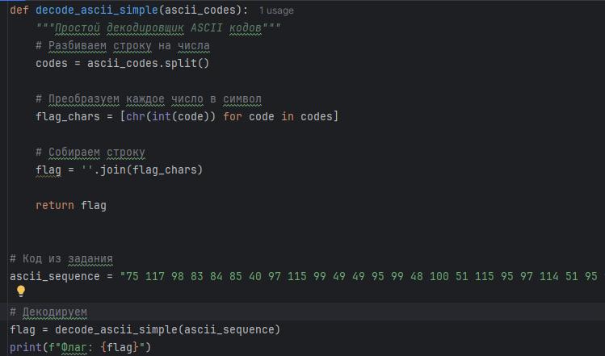

# [crypto] Strange sequence of numbers

> **श्रेणी:** `crypto`  
> **CTF:** KubSTU CTF 2026 Spring

---

मुझे अंदर संख्याओं वाला एक अजीब दस्तावेज़ मिला, इसका क्या मतलब हो सकता है?
फ़्लैग का प्रारूप KubSTU()

[strange_sequence_of_numbers.txt](./files/strange_sequence_of_numbers.txt)

---

समाधान:
हम संख्याओं का एक अनुक्रम देखते हैं, वे काफी भिन्न हैं लेकिन कुछ दोहराई जाती हैं (उदाहरण: संख्या 99)
इससे यह विचार आ सकता है कि इन कोडों के पीछे कोई विशेष प्रतीक है, और सभी संख्याएँ स्पेस से अलग की गई हैं

इन्हें ASCII कोड के रूप में डिक्रिप्ट करने का प्रयास करते हैं

 

 

[Strange sequence of numbers.py](./files/Strange sequence of numbers.py)

फ़्लैग: KubSTU(asc11_c0d3s_ar3_an_1nteresting_w4y_to_ge7_into_cryp70graphy)

