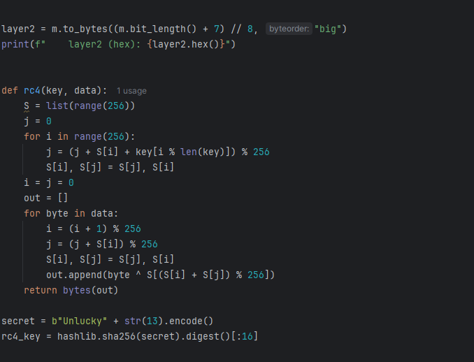

# [crypto] Unlucky 13

> **श्रेणी:** `crypto`  
> **CTF:** KubSTU CTF 2026 Spring

---

13 - अशुभ संख्या। तीन एन्क्रिप्शन परतें, इसे डिक्रिप्ट करने का प्रयास न करने के तेरह कारण। 
कुछ लीक हो गया है, उम्मीद है कि कम से कम इससे तुम्हें मदद मिलेगी।
फ़्लैग का प्रारूप KubSTU{} 

[Unlucky 13.zip](./files/Unlucky 13.zip)

---

encrypt.py खोलते हैं और देखते हैं कि फ़्लैग को एक के बाद एक तीन परतों में एन्क्रिप्ट किया जाता है

1.  कस्टम जनरेटर cursed_prng(13, ...) से बाइट स्ट्रीम के साथ XOR
2.  sha256(b"Unlucky13") से प्राप्त कुंजी के साथ forgotten_cipher फंक्शन
3.  e = 3 के साथ RSA

output.txt में हमें केवल n, e और c — RSA एन्क्रिप्शन का परिणाम — दिया गया है। फ़्लैग तक पहुँचने के लिए तीनों परतों को उल्टे क्रम में पार करना होगा: पहले RSA, फिर परत 2, फिर परत 1

पहले RSA

ध्यान दें कि e = 3। यह बहुत छोटा पब्लिक एक्सपोनेंट है।

RSA इस प्रकार काम करता है: c = m^e mod n, यानी c = m³ mod n.

लेकिन हमारा फ़्लैग \~52 बाइट (416 बिट) है, और n — 2048 बिट का है। इसका मतलब m³ लगभग 1248 बिट है, जो अभी भी n (2048 बिट) से कम है। यानी, घन में उठाते समय mod काम नहीं करता, और c = m³ — बस एक सामान्य संख्या है, बिना किसी mod के

बस c का घनमूल निकालना पर्याप्त है

अब RC4

अब encrypt.py में forgotten_cipher फंक्शन देखते हैं। इसका कहीं नाम नहीं दिया गया है, लेकिन अगर कोड को ध्यान से देखें — 0 से 255 तक ऐरे S का इनिशियलाइज़ेशन, कुंजी द्वारा पुनर्व्यवस्था, फिर PRGA द्वारा स्ट्रीम जनरेशन — यह RC4 है

RC4 एक स्ट्रीम सिफर है, और यह सिमेट्रिक है, यानी एन्क्रिप्शन और डिक्रिप्शन एक ही ऑपरेशन है। उसी डेटा को उसी कुंजी के साथ उसी फंक्शन से गुज़ारते हैं

XOR

अंतिम परत सबसे सरल है। फ़्लैग को सीड=13 वाले कस्टम PRNG से स्ट्रीम के साथ XOR किया गया था। XOR सिमेट्रिक है, इसलिए बस वही स्ट्रीम जनरेट करते हैं और XOR करते हैं

 

 

 

[solve.py](./files/solve.py)

फ़्लैग: KubSTU{unLucky_13_l4y3r5_0f_encrypt10n_n0_luck_h3r3}