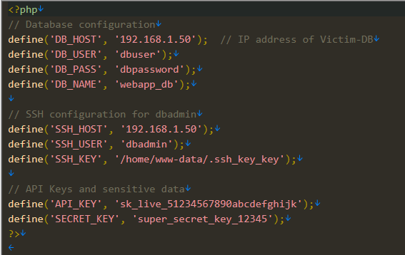

# [forensics] Demo

> **श्रेणी:** `forensics`  
> **CTF:** KubSTU CTF 2026 Spring

---

  सुरक्षा ऑडिट के दौरान कंपनी के वेब सर्वर पर संदिग्ध गतिविधियाँ पाई गईं। माना जा रहा है कि हमलावर नेटवर्क में घुसने, डेटाबेस सर्वर पर पहुँचने और गोपनीय जानकारी चुराने में सफल रहा। 

फ़्लैग का प्रारूप: KubSTU{…}.

 बताइए, किस कमज़ोरी से प्रारंभिक एक्सेस प्राप्त हुआ और उसने क्या अपलोड किया?
हमलावर ने आगे किस उपयोगकर्ता के नाम से काम किया?
क्या कॉपी किया?
उदाहरण: KubSTU{XSS,p0wny.php,Administrator,data.txt}  

[Demo.rar](./files/Demo.rar)

समाधान:

  वेब सर्वर पर Apache के access.log का विश्लेषण करने पर (फ़ाइल /home/ubuntu/Victim-Web/var/log/apache2/access.log) आपको वैध गतिविधि की सैकड़ों प्रविष्टियाँ मिलेंगी। लेकिन, उनमें स्पष्ट रूप से यह प्रविष्टि दिखती है।

```javascript
192.168.1.100 - - [26/Mar/2026:10:16:05 +0300] "GET /index.php?id=1%20UNION%20SELECT%201,%27%3C%3Fphp%20system(%24_GET%5B%22cmd%22%5D)%3B%20%3F%3E%27%20INTO%20OUTFILE%20%27/var/www/html/uploads/shell.php%27 HTTP/1.1" 200 12 "-" "sqlmap/1.6.12 (http://sqlmap.org)"
```

यहाँ स्पष्ट SQLi है और उसके बाद shell.php की अपलोडिंग

आगे हमलावर ने संभवतः किसी तरह डेटाबेस से कनेक्ट किया, लेकिन एक्सेस कहाँ से मिला?

सर्विस की संरचना का विश्लेषण करने पर कई रोचक डेटा दिखते हैं। IP, कुंजियाँ और username। हमलावर ने स्पष्ट रूप से डेटाबेस सर्वर पर उपयोगकर्ता dbadmin की निजी SSH-कुंजी का पथ खोज लिया: /home/www-data/.ssh_key_key। 

 

  फ़ाइल /home/ubuntu/Victim-DB/var/log/auth.log में वेब सर्वर के IP-पते (192.168.1.10) से उपयोगकर्ता dbadmin का सफल SSH-कनेक्शन मिलेगा।  

victim-db sshd[5680]: Accepted publickey for dbadmin from 192.168.1.10 port 54323 ssh-rsa SHA256:hK6cLRP4m5w60fHK1BGmWooBTXIWz+vtVHmuH/luoVQ

आगे उपयोगकर्ता dbadmin के कमांड इतिहास का विश्लेषण दिखाता है कि हमलावर ने गोपनीय DB तक पहुँच प्राप्त की और डेटा कॉपी किया   

 

बस इतना ही, फ़्लैग बनाते हैं

KubSTU{SQLi,shell.php,dbadmin,confidential_data.sql}