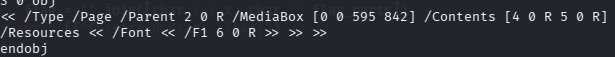

# [forensics] Mutant

> **श्रेणी:** `forensics`  
> **CTF:** KubSTU CTF 2026 Spring

---

## कथानक

बधाई हो! आपने पॉलिटेक में सूचना सुरक्षा में प्रवेश लिया। आपको शैक्षिक सामग्री दी गई। कल परीक्षा है, शुभकामनाएँ।

कठिनाई: आसान

 

[crypt.pdf](./files/crypt.pdf)

## चुनौती का सार

PDF फ़ाइल के अंदर एन्कोडेड और पैक किए गए डेटा हैं, जिनमें फ़्लैग छिपा है।

## संरचना

PDF की खुली सामग्री — चुनौती के समाधान के संदर्भ में बेकार टेक्स्ट। strings का विश्लेषण हमें देगा

 

और साथ ही


 


```javascript
/Contents [4 0 R 5 0 R]
```

इसका मतलब है कि पृष्ठ ऑब्जेक्ट 4 और ऑब्जेक्ट 5 की दो कंटेंट स्ट्रीम से बना है। दो स्ट्रीम का होना संदिग्ध है। ऑब्जेक्ट 5 वास्तव में एन्कोडेड या एन्क्रिप्टेड डेटा है।

स्ट्रीम स्वयं <\~ से शुरू और \~> पर समाप्त होती है, जो ASCII85 एन्कोडिंग की विशेषता है। इसके अलावा /Filter /FlateDecode की उपस्थिति बताती है कि डेटा पहले कंप्रेस और फिर एन्कोड किया गया था।

अंततः, एक स्क्रिप्ट बनानी होगी जो stream और endstream के बीच डेटा निकालेगी, 

## समाधान

चूँकि डेटा एन्कोडेड और पैक किया गया है, पहले डिकोड करना होगा। एन्कोडिंग स्पष्ट है - ASCII85। डिकोडिंग के लिए स्क्रिप्ट बनाते हैं।


[exfil.py](./files/exfil.py)

अब डेटा को अनपैक करना है। अनपैकिंग स्क्रिप्ट बनाते हैं।


[raspak.py](./files/raspak.py)

देखते हैं क्या मिला


 

फ़्लैग की रूपरेखा पहले से दिख रही है। इस चरण पर फ़्लैग को प्रतीक दर प्रतीक मैन्युअली निकाला जा सकता है, या फिर से स्क्रिप्ट बनाई जा सकती है।

फ़्लैग:  KubSTU{pdf_0bj3ct_m4st3r_v2}  