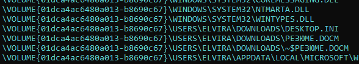
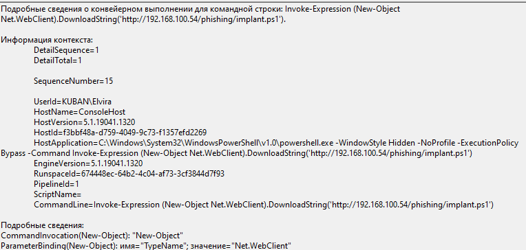
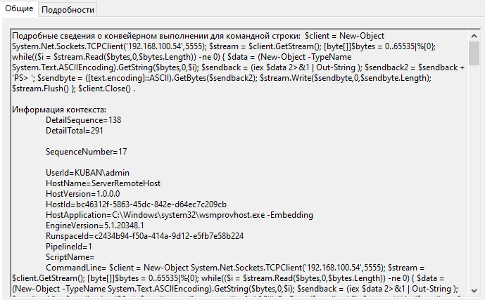

# [forensics] We have an incident!

> **श्रेणी:** `forensics`  
> **CTF:** KubSTU CTF 2026 Spring

---

हमारी कंपनी में, ऐसा लगता है, एक घटना हुई है, अभी कुछ स्पष्ट नहीं है, हमने सावधानी के तौर पर कुछ मशीनों को आइसोलेट कर दिया। प्रतिक्रिया टीम वायरस विश्लेषकों के साथ मिलकर काम कर रही है। अपना काम आसान बनाने के लिए उन्हें मैलवेयर प्रदान करना होगा, जो आपको खोजना होगा। साथ ही संदेह है कि एक्सफ़िल्ट्रेशन किया गया था। पता लगाओ कि क्या हुआ।

फ़्लैग का प्रारूप KubSTU{कमज़ोरी/हमला जिसने प्रिविलेज एस्केलेशन किया:मैलवेयर की सूची उनके एक्सटेंशन सहित:एक्सफ़िल्ट्रेट किया गया डेटा}

ध्यान दें! सूचियाँ उनके टाइमस्टैम्प के अनुसार, रजिस्टर को ध्यान में रखते हुए, पहले से बाद के क्रम में लिखें। एक्सफ़िल्ट्रेशन के मामले में भी ऐसा ही करें।

उदाहरण: KubSTU{polkit:PwnKit.exe_revershell.exe_WannaCry.exe:Конфданные.doc:users.db}


[We have an incident.rar](./files/We have an incident.rar)

समाधान: 

हमारे सामने मशीनों से निकाले गए डेटा हैं, प्रत्येक मशीन से हमें आर्टिफैक्ट्स (MFT, Amcache, prefetch, लॉग आदि) प्रदान किए गए हैं। 

विश्लेषण शुरू करते हैं, हमें कोई जानकारी नहीं है कि क्या हुआ, कब और क्यों। MFT देखते हैं (कई रास्तों से जा सकते हैं, आपकी पसंद)

इस प्रक्रिया में मैं Eric Zimmerman के टूल्स का उपयोग करूँगा। रॉ MFT को संरचित करते हैं, csv में सहेजते हैं और पढ़ते हैं। 

हमारे सामने बहुत सारी पंक्तियाँ होंगी, उनमें कुछ उपयोगी हो सकता है। MFT फ़ाइल स्वयं एक तालिका है जिसमें सिस्टम में मौजूद सभी फ़ाइलों की जानकारी होती है, जिसमें छिपी हुई फ़ाइलें, उनके एक्सटेंशन, और संशोधन/निर्माण/एक्सेस के टाइमस्टैम्प आदि शामिल हैं।

हमारी मशीन HR है, इसका मतलब यह सोचा जा सकता है कि काम अक्सर दस्तावेज़ों के साथ होता था। MFT में फ़ाइल एक्सटेंशन का फ़ील्ड भी है

ऐसे एक्सटेंशन को आज़मा सकते हैं जो स्पष्ट रूप से संकेत दें कि यहाँ कुछ गड़बड़ है।

Резюме.docm फ़ाइल का एक्सटेंशन बताता है कि अंदर मैक्रोज़ हो सकते हैं। डायरेक्टरी बताती है कि फ़ाइल संभवतः डाउनलोड की गई थी, लेकिन क्या चलाई गई? जाँचते हैं

 

Резюме.docm फ़ाइल का एक्सटेंशन बताता है कि अंदर मैक्रोज़ हो सकते हैं। डायरेक्टरी बताती है कि फ़ाइल संभवतः डाउनलोड की गई थी, लेकिन क्या चलाई गई? जाँचते हैं।

चलाया गया या नहीं, यह prefetch फ़ाइलों की जाँच से पता लगाया जा सकता है। ये सिस्टम की गति को अनुकूलित करने के लिए बनाई गई हैं, इनमें उपयोग किए गए संसाधनों के पथ और उन फ़ाइलों की सूची होती है जिनके साथ काम किया गया। इसे भी संरचित करना होगा और दिखता है कि यह चलाया गया था

 

देखते हैं कि MFT में इसके बाद क्या दिखा। इसके बाद कई रोचक चीज़ें दिखती हैं

Certify.exe - Active Directory Certificate Services (AD CS) में गलत कॉन्फ़िगरेशन खोजने और उपयोग करने के लिए डिज़ाइन किया गया प्रोग्राम। 

Rubeus.exe - यह Kerberos के साथ काम करने और उसका दुरुपयोग करने का टूल है। 

आगे टेक्स्ट फ़ाइलें दिखती हैं, जो संभवतः सिस्टम के बारे में एकत्र की गई जानकारी है, प्रारंभिक रिकॉनेसेंस के रूप में।  

 

Certify.exe - Active Directory Certificate Services (AD CS) में गलत कॉन्फ़िगरेशन खोजने और उपयोग करने के लिए डिज़ाइन किया गया प्रोग्राम। 

Rubeus.exe - यह Kerberos के साथ काम करने और उसका दुरुपयोग करने का टूल है। 

आगे टेक्स्ट फ़ाइलें दिखती हैं, जो संभवतः सिस्टम के बारे में एकत्र की गई जानकारी है, प्रारंभिक रिकॉनेसेंस के रूप में।  

और क्या? देखते हैं क्या हो रहा था। यह असंभव है कि फ़िशिंग फ़ाइल की यही सारी कार्यक्षमता थी, लॉग देखते हैं (HR\C\Windows\System32\winevt\logs)। वैसे अगर आपने इस चरण पर पहले ही Mimikatz का prefetch देखा है, तो अच्छा है। MFT में यह थोड़ा नीचे होगा।


 

Security लॉग में ये इवेंट दिखाई दे सकते हैं


 

लॉगऑन टाइप - 3, नेटवर्क। अकाउंट का नाम HR। मान लेते हैं कि हमलावर ने एक्सेस प्राप्त कर लिया। लेकिन और विस्तार से देखना होगा। हमारे पास इवेंट, फ़ाइलों के प्रकट होने और उनके चलाए जाने के टाइमस्टैम्प हैं, Windows Powershell लॉग देखते हैं। एक रोचक विवरण दिखता है, कुछ ps कमांड निष्पादित किए गए, यह फ़ाइल ही हमलावर को रिवर्स शेल स्थापित करवाती है। साथ ही हमारे पास हमलावर का IP भी है।


 

mimikatz की डाउनलोडिंग का डेटा है, आगे इसके काम के इवेंट होंगे। और आगे देखते हैं।


 

आगे mimikatz द्वारा निकाली गई कुंजी की एक्सफ़िल्ट्रेशन दिखाई दे सकती है।

 

वैसे प्रिविलेज एस्केलेशन में mimikatz की कोई भूमिका नहीं है), प्रयास किया गया था, लेकिन सफल नहीं रहा। लेकिन mimikatz इवेंट से पहले certify का काम दिखता है। जिसने प्राइवेट कुंजी और कमज़ोर सर्टिफिकेट VulnerableUserSAN निकाला, अनुरोध में name डालने का प्रयास करते हुए। अंततः नाम अनुरोध में सफलतापूर्वक डाल दिया जाता है। कमांड:
.\Certify.exe request /ca:DC1.kuban.loc\kuban-DC1-CA /template:VulnerableUserSAN /altname:admin /subject:"CN=admin, CN=Users, DC=kuban, DC=loc". 


 

फिर हमलावर ने संभवतः डेटा कॉपी किया और अपनी कुंजी बनाई और मशीन पर स्थानांतरित की और rubeus का उपयोग करके इम्प्लांट किया। यह कुछ इवेंट ऊपर दिखता है। कमांड: .\Rubeus.exe asktgt /user:admin /certificate:C:\Users\Public\admin.pfx /password:"" /nowrap /ptt"


 

दिखता है कि इम्प्लांटेशन सफल रहा, जिसका मतलब है कि हमलावर का प्रिविलेज एस्केलेशन सफल हुआ। यह हमला ESC1 है। आगे देखते हैं। एक्सफ़िल्ट्रेशन का प्रयास दिखता है, लेकिन यह सफल नहीं है।


 

और यह रोचक है, एक अज्ञात यूटिलिटी। वास्तव में यह C2 sliver का इम्प्लांट है।


 

बाद में देखा जा सकता है कि इस फ़ाइल को दूसरी डायरेक्टरी में स्थानांतरित किया गया।


 

इस मशीन पर यह सब है।

DC मशीन देखते हैं। यह डोमेन कंट्रोलर है। Powershell लॉग देखते हैं।


 

हमलावर के IP पर रिवर्स शेल दिखता है। आगे कुछ रोचक है

 

AD डेटाबेस की कॉपी। SYSTEM फ़ाइलों की भी कॉपी है

 

थोड़ा और आगे पहले से कॉपी की गई फ़ाइलों की एक्सफ़िल्ट्रेशन दिखती है। केवल ntds.dit एक्सफ़िल्ट्रेट हुई


 

प्रारूप के अनुसार अपना फ़्लैग बनाते हैं।

  

```javascript
KubSTU{ESC1:Резюме.docm_Certify.exe_Rubeus.exe_mimikatz.exe_wlmss.exe:0-40e10000-admin@krbtgt~kuban.loc-KUBAN.LOC.kirbi_ntds.dit}
```


  