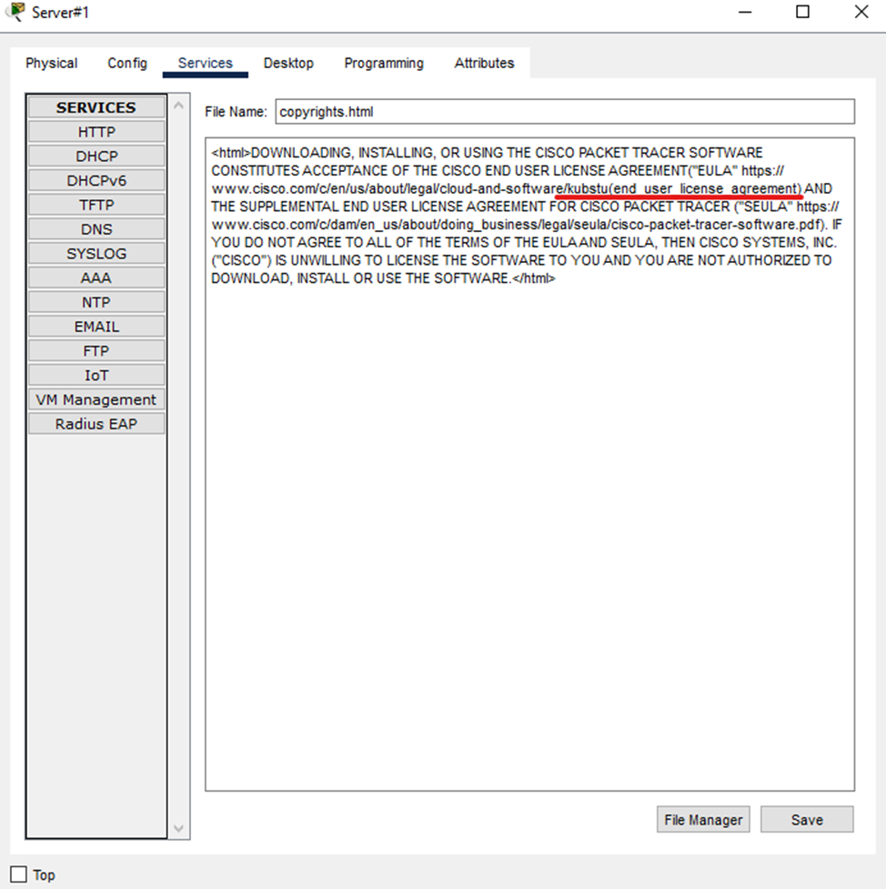

# [network] Nut legends

> **श्रेणी:** `network`  
> **CTF:** KubSTU CTF 2026 Spring

---

         

[LightA.pkt](./files/LightA.pkt)

          

नेटवर्क टोपोलॉजी में विसंगति पाई गई। लक्ष्य नोड तक सीधा पहुँच OSI मॉडल के कई स्तरों पर ब्लॉक है। आपको एंट्री पॉइंट (PC Cooper R.) और एकमात्र आर्टिफैक्ट — एक इमेज फ़ाइल — प्रदान की गई है। एक्सेस की चेन पुनर्स्थापित करें और फ़्लैग लें।

    राइटअप

दिखता है कि किसी कारण से सर्वर पिंग नहीं हो रहा, हालाँकि केबल लगी हुई है।

- **विश्लेषण:**      स्विच पर show vlan brief कमांड दिखाता है कि सर्वर      पोर्ट Fa0/10 (VLAN 1) पर है, जबकि उसे **VLAN 20** (पोर्ट Fa0/2) में होना चाहिए।
- **समाधान:**      सर्वर का केबल पोर्ट **Fa0/2** में स्विच करें। अब सर्वर अपने      लॉजिकल सेगमेंट में है।
- वैकल्पिक समाधान: कनेक्टेड पोर्ट पर VLAN कॉन्फ़िगरेशन बदलें

जब दिखे कि कंप्यूटर से सर्वर तक पिंग जाने लगा, कंप्यूटर पर वेब ब्राउज़र खोलें

 

 

 

 

Flag: kubstu(end_user_license_agreement)