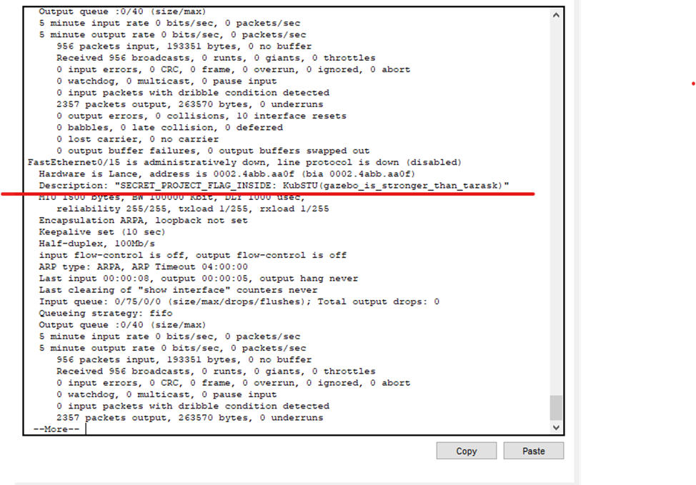

# [network] The skeleton key

> **श्रेणी:** `network`  
> **CTF:** KubSTU CTF 2026 Spring

📎 चुनौती की फ़ाइलें

| फ़ाइल | प्रकार |
|------|-----|
| [3 in 1 .pkt](./files/img_1.pkt) | `pkt` |

---

संदेश: «सुनो, हमारे किसी स्विच पर कुछ अव्यवस्था है। पोर्ट पर लगातार एरर आ रहे हैं, लॉग भरे हुए हैं, लेकिन किसी कॉन्फ़िगरेशन ब्लॉक के कारण मैं एक्सेस लेवल पार नहीं कर पा रहा कि समझूँ कौन सा इंटरफ़ेस ख़राब है।

देख लो कि वहाँ क्या हो रहा है — मुझे सिर्फ़ रिपोर्ट नहीं बल्कि समाधान चाहिए, ताकि नेटवर्क चेतावनियाँ देना बंद करे। कॉन्फ़िगरेशन उड़ाने की सोचना भी मत!»

राइटअप

1. समस्या वाला CORE SWITCH खोजें।

2. बैनर में खिलाड़ी को स्विच सेटिंग्स में प्रवेश के लिए Base64 एन्कोडेड पासवर्ड मिलता है।
3. enable दर्ज करने पर पासवर्ड माँगा जाएगा। जो उसने अभी प्राप्त किया।
4. Show interfaces दर्ज करने पर पोर्ट के विवरण में फ़्लैग ढूंढना होगा।
