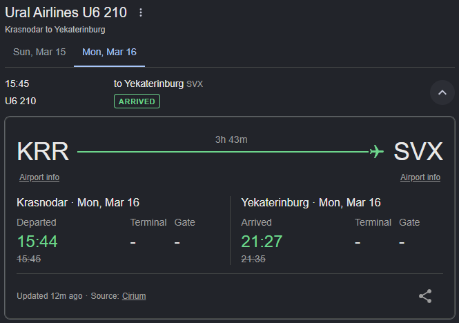

# [osint] Bad OpSec

> **श्रेणी:** `osint`  
> **CTF:** KubSTU CTF 2026 Spring

कठिनाई: medium  

मेरे एक परिचित ने बहुत ज़्यादा हैकर फ़िल्में देखी हैं और वैसे ही गुप्त रहने की कोशिश कर रहा है। चलो उसे समझाते हैं कि ऐसा नहीं है। उसकी उड़ान का नंबर ढूँढो जिससे वह आया, और कितने बजे।

फ़्लैग का प्रारूप: `KubSTU{Flight_City_Arrival:Time}`

---

A friend of mine watched too many hacker movies and is trying to be just as secretive. Let's show him that it's not working. Find the flight number he arrived on and at what time.

Flag format: `KubSTU{Flight_City_Arrival:Time}`

 

---

## **हमें क्या दिया गया**

पहली नज़र में लगता है कि उपयोगी जानकारी शून्य है, लेकिन ध्यान से देखें तो हमारे पास अभी भी है:

- तिथि
- बोर्डिंग समाप्ति का समय
- गेट नंबर
- विमान में सीट
- और सबसे महत्वपूर्ण - **बारकोड**

---

## **चरण 1. बारकोड का प्रकार निर्धारित करना**

पहले थोड़ा सिद्धांत।
अगर गूगल करें कि बोर्डिंग पास पर कौन से बारकोड उपयोग होते हैं, तो जल्दी पता चलता है कि यह **PDF417** है।

यह दिखावट और लेखों दोनों से पुष्ट होता है:

- Habr: <https://habr.com/ru/companies/panda/articles/270029/>
- Habr: <https://habr.com/ru/articles/578392/>
- Reddit: <https://www.reddit.com/r/airportceo/comments/6xvyl5/barcodes_on_boarding_passes/?tl=ru>

   

यानी आगे काम बहुत सरल प्रश्न पर आ जाता है:
**इसे किससे डिकोड करें?**

---

## **चरण 2. PDF417 डिकोड करना**

कोई भी ऑनलाइन PDF417 स्कैनर खोजते हैं।
मैंने यह उपयोग किया: <https://demo.dynamsoft.com/barcode-reader/>

चित्र अपलोड करते हैं - और ऐसी स्ट्रिंग मिलती है:

M1PETLITSA/ALEKSEI IGOE93KTGB KRRSVXU6 0210 046Y017D0003 151>2180OO6046B 29262 0 U6 1003750527 0776298473

पहली नज़र में कचरा लगता है, लेकिन वास्तव में यहाँ पहले से लगभग पूरा उत्तर है।

---

## **चरण 3. मार्ग और उड़ान निकालना**

पहली चीज़ जो ध्यान खींचती है — खंड:

KRRSVX

यह रैंडम अक्षर नहीं, बल्कि **दो IATA हवाई अड्डा कोड एक साथ** हैं:

- **KRR** — क्रास्नोदार
- **SVX** — येकातेरिनबर्ग

यानी, मार्ग:
**क्रास्नोदार → येकातेरिनबर्ग**

आगे देखते हैं:
U6 0210

यह पहले से **उड़ान संख्या** है:

- **U6** — एयरलाइन *Уральские авиалинии* का कोड
- **0210** → उड़ान **U6 210**

इस चरण पर पहले से विश्वास से कहा जा सकता है:

> हमारे सामने **Уральские авиалинии की उड़ान U6 210** **क्रास्नोदार से येकातेरिनबर्ग** है।
>
>  

---

## **चरण 4. वास्तविक आगमन समय ढूँढना**

अब चुनौती का दूसरा भाग पूरा करना बाकी है - **वह कितने बजे पहुँचा**।

हमारे पास पहले से है:

- उड़ान संख्या: **U6 210**
- मार्ग: **KRR → SVX**
- बोर्डिंग पास पर तिथि

इन डेटा के साथ **FlightAware** पर जाते हैं और आवश्यक उड़ान खोजते हैं।

<https://www.flightaware.com/>

उड़ान **U6 210** ढूँढते हैं, उड़ान इतिहास खोलते हैं और **15 फरवरी** (पास की तिथि के अनुसार) की उड़ान देखते हैं।
वहाँ येकातेरिनबर्ग में वास्तविक आगमन समय दिखता है।

**अंतिम स्थानीय आगमन समय: 21:39**

 

---

## **फ़्लैग**

चुनौती के प्रारूप के अनुसार सब इकट्ठा करते हैं:

- FlightNumber → `U6-210`

- City → `Ekaterinburg`

- LocalTime → `21:39`

### **फ़्लैग:**

`KubSTU{U6210_Ekaterinburg_21:39}`

  

