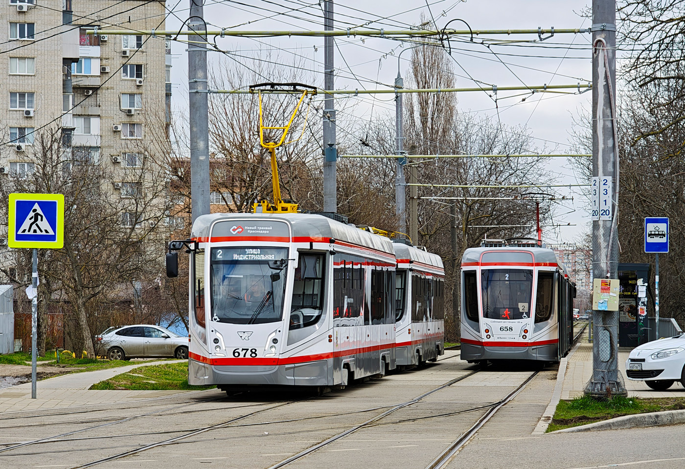

# [stego] Krasnodar tram

> **श्रेणी:** `stego`  
> **CTF:** KubSTU CTF 2026 Spring

---

मुझे क्रास्नोदार के ट्राम बहुत पसंद हैं। यह बहुत सुविधाजनक, तेज़ और सस्ता है। ट्राम के वाइब में डूबो और मेरा संदेश ढूंढो।

मेटाडेटा देखने से समाधान शुरू करते हैं।
PS S:\CTF\steg> exiftool 267.jpg
(मेटाडेटा आउटपुट में base64 ब्लॉक दिखते हैं: Ly9r=, aHR0=, dHUu=, cy0x= आदि)

दोनों तस्वीरों के मेटाडेटा में 4 कैरेक्टर और अंत में = वाले ब्लॉक दिखते हैं। अनुमान लगा सकते हैं कि ये सब एक b64 स्ट्रिंग के हैं। सभी ब्लॉक निकालते हैं और न्यूरल नेटवर्क से ब्लॉकों के साथ खेलकर कार्यशील स्ट्रिंग ढूंढने को कहते हैं।
import base64

# 267.jpg से ब्लॉक (विषम स्थितियाँ)
blocks_267 = ['Ly9r=', 'aHR0=', 'dHUu=', 'cy0x=', 'cy0x=', 'dHUu=', 'Ly9r=', 'aHR0=', 'aHR0=', 'Ly9r=', 'dHUu=', 'cy0x=']

# 678.jpg से ब्लॉक (सम स्थितियाँ)
blocks_678 = ['cHM6=', 'dWJz=', 'Njk==', 'cnUv=', 'cHM6=', 'cnUv=', 'dWJz=', 'cHM6=', 'dWJz=', 'cnUv=', 'Njk==']

स्क्रिप्ट का परिणाम: //kps:httubstu.69s-1ru/s-1ps:tu.ru///kubshttps:httubs//kru/tu.69s-1
अतिरिक्त रूप से एक स्क्रिप्ट भी उपयोग कर सकते हैं जो प्राप्त स्ट्रिंग में वैध लिंक ढूंढने की कोशिश करे।

ध्यान से देखने पर स्ट्रिंग में https:, //kubs, tu.ru, s-1, 69 दिखते हैं। इन्हें एक साथ जोड़ने पर https://kubstu.ru/s-169 मिलता है। लिंक पर जाने पर हमारे शानदार साइबर सुरक्षा और सूचना संरक्षण विभाग का पेज दिखता है। फिर निष्कर्ष निकालते हैं कि हम कहीं गलत आ गए(
मेटाडेटा देखने के चरण पर वापस जाते हैं और देखते हैं कि और भी ब्लॉक हैं, बिल्कुल वैसे ही दिखने वाले, इस प्रारूप में: iso=200|Q3N2, wb=135|b20v।
फिर से मेटाडेटा से जाते हैं, सभी ब्लॉक इकट्ठा करते हैं और कार्यशील लिंक खोजने के लिए उनके साथ खेलना शुरू करते हैं।

स्क्रिप्ट का आउटपुट:
=== प्रत्येक ब्लॉक का अलग डीकोडिंग ===
267.jpg से: b20v -> 'om/', ZWJp -> 'ebi', Q3N2 -> 'Csv', Ly9w -> '//p', aHR0 -> 'htt'
678.jpg से: cHM6 -> 'ps:', YXN0 -> 'ast', U3VC -> 'SuB', bi5j -> 'n.c', cEs= -> 'pK'

इससे निष्कर्ष निकालते हैं कि यहाँ https:// है, डोमेन p से शुरू होता है और शायद n.com/ पर समाप्त => अनुमान लगा सकते हैं कि यह pastebin.com का लिंक होगा।

कुछ मिनटों के काम के बाद हमें इच्छित लिंक https://pastebin.com/raw/SuBCsvpK और फ़्लैग मिलता है — KubSTU{g0d_s4v3_7h3_kr45n0d4r_7r4m}
चुनौती हल हो गई)
