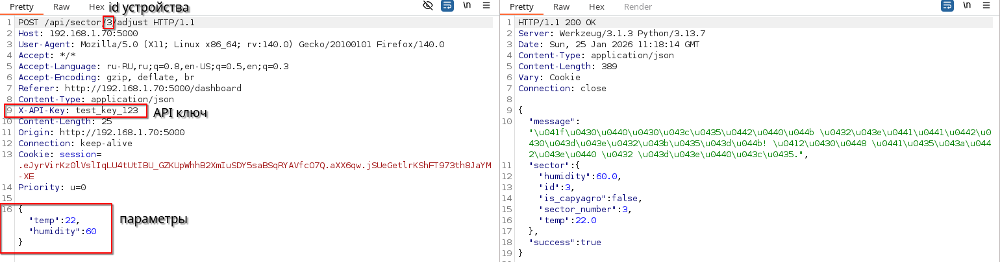

# [web] CapyAgro Crop Rescue

> **श्रेणी:** `web`  
> **CTF:** KubSTU CTF 2026 Spring

## विवरण

CapyAgro के क्षेत्र में प्रयोगात्मक ग्रीनहाउस №3 में प्रबंधन प्रणाली में खराबी आ गई। स्टाफ इंजीनियर कंट्रोल पैनल तक पहुँच नहीं पा रहे। पौधे मर रहे हैं। 

आपको, बाहरी ऑडिटर के रूप में, सिस्टम पर नियंत्रण बहाल करने और पैरामीटर सामान्य करने का तरीका खोजना है

## समाधान

1) रजिस्ट्रेशन के बाद अपने वर्चुअल सेक्टर बदलने का प्रयास करें 

 

2) भेजे गए पैकेट को इंटरसेप्ट और विश्लेषण करते हैं

 

 3) लक्ष्य सेक्टर का विश्लेषण करते हैं और लक्ष्य डिवाइस की id प्राप्त करते हैं

 

4) इसका फ़ायदा उठाते हैं और डिवाइस id बदलकर CapyAgro सेक्टर को नए मान भेजते हैं

 

5) सेक्टर स्थिर कर दिया और फ़्लैग मिल गया

## फ़्लैग

```graphql
KubSTU(Sav3d_th3_CapyArg0S3ct0r)
```

