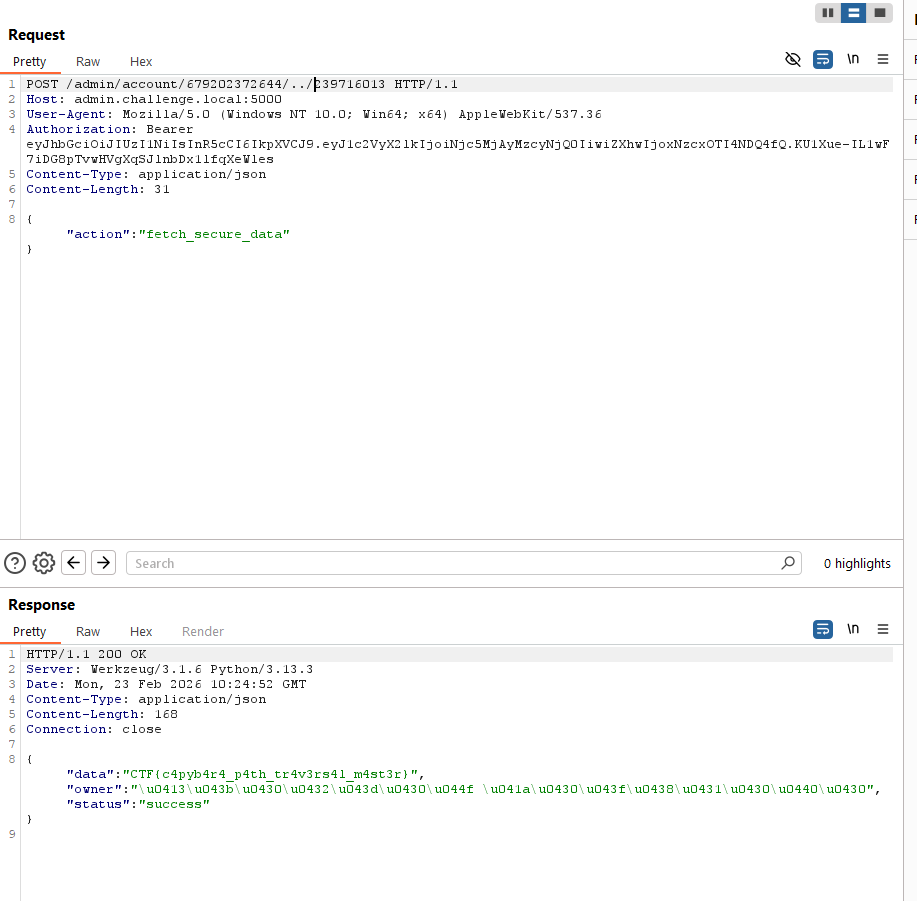

# [web] Capybara Admin Portal

> **श्रेणी:** `web`  
> **CTF:** KubSTU CTF 2026 Spring


## चुनौती का विवरण

कैपीबारा एडमिन कोई महत्वपूर्ण रहस्य छिपा रहा है। हमें केवल उनके खाते की ID पता चली — `239716013`। जितनी जल्दी हो सके यह रहस्य निकालें।

## चरण 1: सूचना एकत्रण और User Enumeration

मुख्य पेज खोलते हैं। लॉगिन फ़ॉर्म दिखता है। यादृच्छिक डेटा दर्ज करके देखते हैं।

- `test:test` दर्ज → उत्तर: `404 उपयोगकर्ता बाड़े में नहीं मिला`।
- `admin:admin` दर्ज → उत्तर: `404 उपयोगकर्ता बाड़े में नहीं मिला`।


यह क्लासिक **User Enumeration** भेद्यता है। सर्वर हमें बताता है कि उपयोगकर्ता मौजूद है या नहीं। `rockyou.txt` सूची से ब्रूटफ़ोर्स शुरू करते हैं। काफ़ी जल्दी `angel` नाम मिल जाता है।

- `angel:test` दर्ज → उत्तर: `401 कैपीबारा के लिए गलत पासवर्ड`।


उपयोगकर्ता `angel` मौजूद है!


## चरण 2: पासवर्ड का Brute-force

अब उसी `rockyou.txt` सूची से `angel` उपयोगकर्ता के पासवर्ड का ब्रूटफ़ोर्स करते हैं। सही पासवर्ड मिलता है: `princess`।


## चरण 3: 2FA को बायपास करना (JWT Leak)

सही क्रेडेंशियल दर्ज करने के बाद हमें `/2fa` पेज पर भेजा जाता है। यहाँ 6-अंकीय कोड दर्ज करने को कहा जाता है। हालाँकि, डेवलपर टूल्स में Network टैब में `/login` रिक्वेस्ट देखने पर पता चलता है कि सर्वर ने JSON लौटाया:

```json
{
  "token": "eyJhbGciOiJIUzI1NiI...",
  "user_id": "679202372644",
  "redirect": "/2fa"
}
```

सर्वर ने 2FA पास करने **से पहले** ही **JWT टोकन** जारी कर दिया। यह लॉजिक त्रुटि है (2FA Bypass)। इस टोकन का उपयोग API में प्राधिकरण के लिए किया जा सकता है।


## चरण 4: API विश्लेषण और Path Traversal

2FA पेज पर कंसोल (F12) खोलते हैं। लॉग दिखते हैं: `[API] खाता प्रबंधन का आंतरिक एंडपॉइंट: POST /admin/account/679202372644`


अगर इस एंडपॉइंट पर अपने टोकन के साथ रिक्वेस्ट करें:

```javascript

getAccountData('679202372644')
```

रिस्पॉन्स आता है कि हमारे पास फ़्लैग का अधिकार नहीं, और फ़्लैग `239716013` में है।


अगर सीधे आज़माएँ:

```javascript

getAccountData('239716013')
```

`403 पहुँच त्रुटि` मिलती है। सर्वर जाँचता है कि URL में ID हमारे टोकन की ID से मेल खाती है।


लेकिन API हैंडल `path` पैरामीटर का उपयोग करता है, जो डायरेक्टरी ट्रैवर्सल अक्षरों को फ़िल्टर नहीं करता। हम **Path Traversal** का उपयोग कर सकते हैं ताकि पथ में हमारी ID (जाँच पास करने के लिए) और लक्ष्य ID दोनों हों।


## चरण 5: फ़्लैग प्राप्ति

रिक्वेस्ट बनाते हैं, जहाँ पथ ऐसा दिखेगा: `/admin/account/679202372644/../239716013`। ताकि सर्वर कोड में प्रोसेसिंग से पहले डॉट्स को "मर्ज" न करे, स्लैश के लिए URL-एन्कोडिंग (`%2f`) उपयोग करते हैं।


ब्राउज़र कंसोल में अंतिम रिक्वेस्ट:

```javascript

fetch('/admin/account/679202372644%2f..%2f239716013', {
    method: 'POST',
    headers: { 
        'Authorization': 'Bearer ' + localStorage.getItem('jwt'),
        'Content-Type': 'application/json'
    },
    body: JSON.stringify({ action: 'fetch_secure_data' })
}).then(res => res.json()).then(console.log);
```


 

**परिणाम:** `{"status": "success", "owner": "Главная Капибара", "data": "KubSTU{c4pyb4r4_p4th_tr4v3rs4l_m4st3r}"}`


फ़्लैग: `KubSTU{c4pyb4r4_p4th_tr4v3rs4l_m4st3r}ч]`
