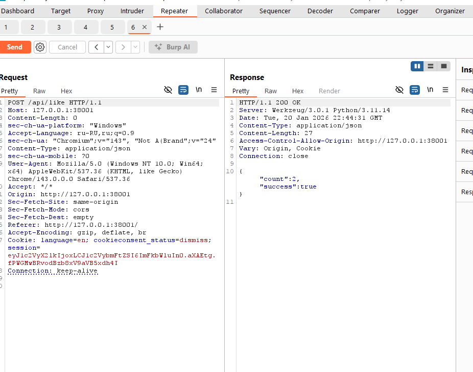
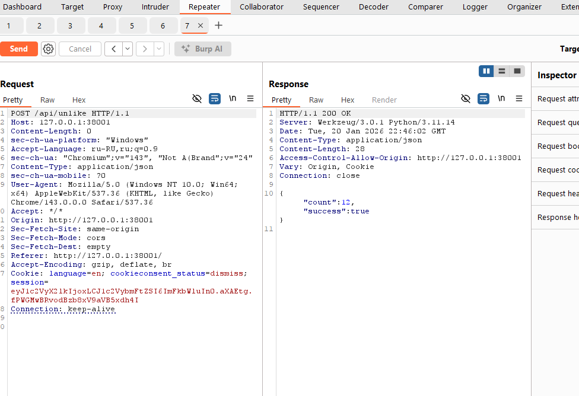

# [web] The Battle of the Strongest

> **श्रेणी:** `web`  
> **CTF:** KubSTU CTF 2026 Spring

---

## कथा

  

हर सेमेस्टर कैपीबारा-छात्र इस बारे में बहस करते हैं कि कौन सा विभाग बेहतर है, पढ़ाई में कौन मज़बूत है, छात्र जीवन में कौन अधिक सक्रिय है।

इस साल उत्साही कैपीबाराओं ने प्रतिद्वंद्विता को डिजिटल दुनिया में लाने का फ़ैसला किया और एक अभिनव सेवा **"सबसे मज़बूत की लड़ाई"** (The Battle of the Strongest) बनाई। बस लगता है कि यह सबसे सुरक्षित सेवा नहीं है।


चुनौती की फ़ाइलें

[The_Battle_of_the_Strongest.rar](./files/The_Battle_of_the_Strongest.rar)

---

सेवा पर जाते हैं और रजिस्टर करते हैं 

हमें मुख्य पेज पर ले जाया जाता है


 


चुनौती का सार यह है कि कई टीमें आती हैं और लाइक की संख्या चुन सकती हैं जो राउंड के अंत में होनी चाहिए।


 

मैंने 12 रखा

आगे बढ़ते हैं और 0 दिखता है


 

अगर लाइक करें 


 

और बटन लाल हो जाएगा

अगर दबाकर हटाएँ तो -1 होगा।

ठीक है। रिक्वेस्ट पकड़ते हैं।


 


देखते हैं कि अगर दूसरी बार भेजें - सर्वर स्वीकार करता है। जाँच केवल क्लाइंट पर है।


 


ज़रूरी संख्या तक स्पैम करते हैं, हमारा है 12


 


ज़्यादा हो गया, कम करने का प्रयास


 

आज़माते हैं


 

और 12 मिल गया 


 

समय समाप्त होने का इंतज़ार करते हैं और देखते हैं कि लाइक की संख्या आवश्यक मात्रा में रहे। 

व्यवहार में CTF की शुरुआत में स्वाभाविक रूप से प्रतिद्वंद्विता होगी और तर्क और अच्छे बॉटनेट जीतेंगे।


 

व्यक्तिगत कैबिनेट में जाते हैं


 

---

```javascript
KubSTU(Y0u_ar3_champ10n)
```

