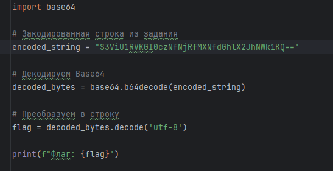

# [crypto] Base

> **Категория:** `crypto`  
> **CTF:** KubSTU CTF 2026 Spring

---

Мы перехватили странное сообщение.  Кажется, оно закодировано популярным методом. Помоги понять, что там написано.  
Формат флага KubSTU()

[Base.txt](./files/Base.txt)

---

Решение:
Структура строки и само название задание прям кричит о том, что это base кодировка, осталось перепробовать её вариации.
Валидным оказывается только base64

 

 

[Base.py](./files/Base.py)

Флаг: KubSTU(b4s3_64_1s_the_ba5i5)

