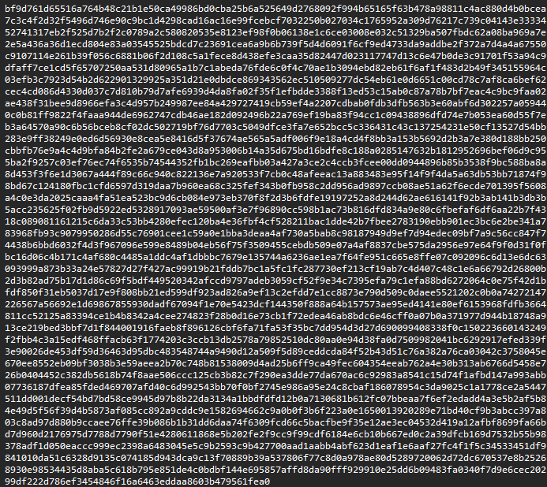
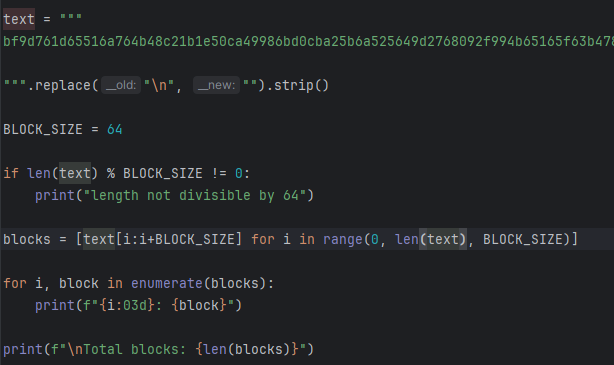
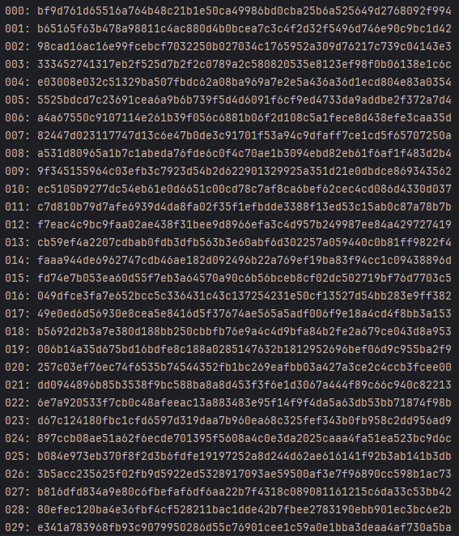
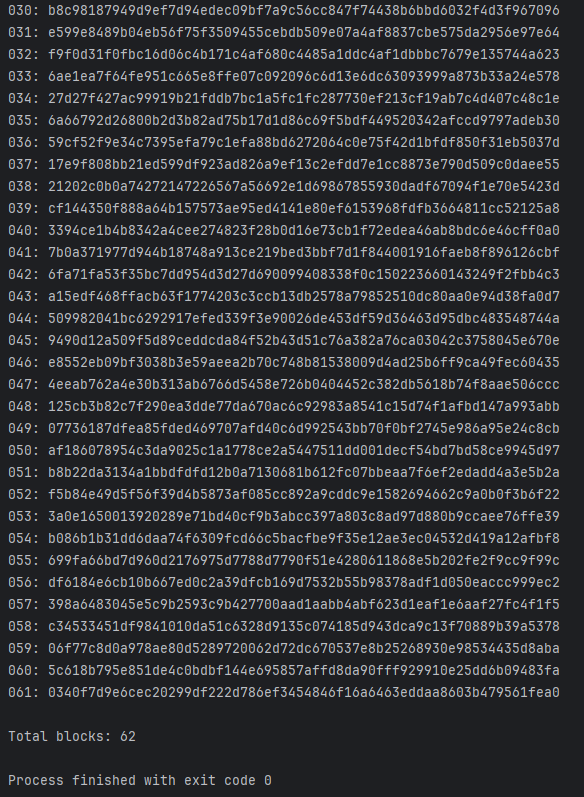

# [crypto] Cat-girl conspiracy

> **Категория:** `crypto`  
> **CTF:** KubSTU CTF 2026 Spring

---

Слушай, какой-то странный это архив, ещё и название какое-то странное??
Разберись с этим как только сможешь, пожалуйста
Формат флага KUBSTU{}

[64_what_could_this_mean.zip](./files/64_what_could_this_mean.zip)

---

Решение:
Архив с кучей папок и одним лишь текстовиком
Кстати, если посмотреть на название архива и текстовика, то обнаружим что названия почти одинаковые, разница в числе 64 (запомним это)

Откроем его

 

Что с этим делать пока непонятно 
Возможно это хэши просто склеенные вместе
Обратим внимание на название архива там есть число 64, тогда попробуем разделить этот текст на блоки по 64 символа 

 

 

 

Теперь обратим внимание на папки и что в них
Там куча фотографий и у каждой есть свой хэш, плюс заметим что эти фотографии лежат в папках со специфичными названиями

Попробуем написать скрипт который будет находить фотографии по хэшам, которые мы получили, и смотреть из какой это папки фотография

[solve.py](./files/solve.py)

Посмотрим на вывод скрипта:

 

Флаг: KUBSTU{A7_LE4ST_N0W_Y0U_H4V3_A_BUNCH_0F_P1CTUR3S_OF_C4T_GIRL5}

