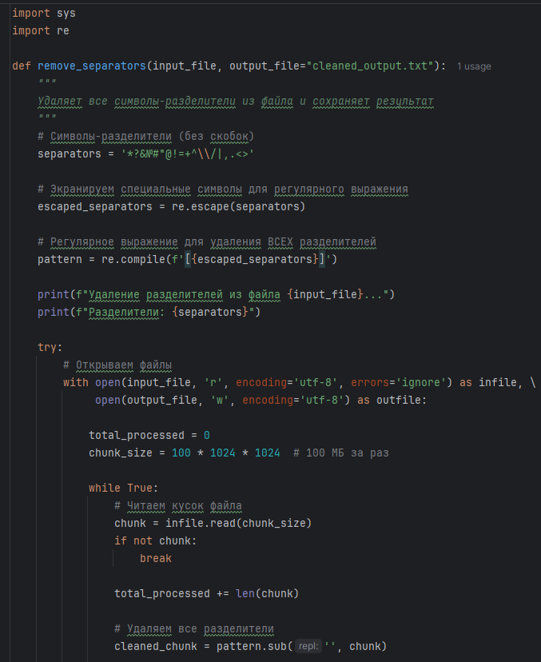
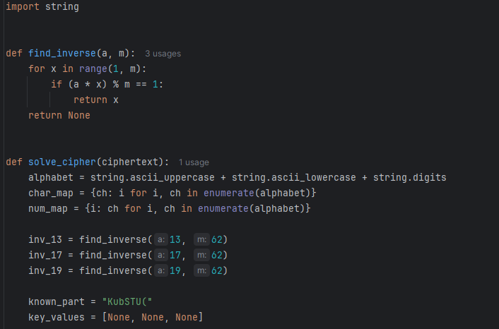
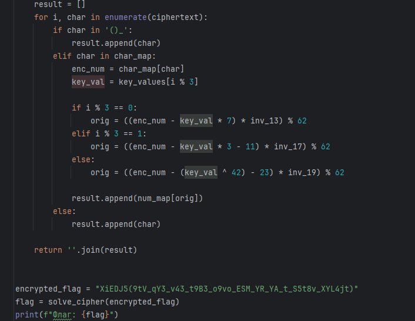

# [crypto] Furry Cipher

> **Категория:** `crypto`  
> **CTF:** KubSTU CTF 2026 Spring

---

Пролистывал свою почту и увидел письмо от FurryHater_2009) с просьбой расшифровать какое-то странное сообщение, а также он прикрепил два файла.

Формат флага KubSTU()

[Furry Cipher.zip](./files/Furry Cipher.zip)

---

Решение:
Видим самопальный алгоритм шифрования и большой текстовый файл в котором куча символов
они используются как заглушки-надо убрать

Сам ник FurryHater_2009) нам подсказывает какие символы разрешены, то есть( A-z 0-9 _ () ) это будет наш разрешённый алфавит, значит в запрещённый входит ( *?&№#"@!=+^\ /|,.<>'“ )

Значит убираем то, что не входит в наш алфавит и получаем зашифрованный флаг разбитый на 4 части собираем его и начинаем смотреть второй файл сам алгоритм

 

 

 

 

[Solver furry text.py](./files/Solver furry text.py)

После сбора частей флага получаем цельный, но зашифрованный флаг

Нам нужно повторить алгоритм только инвертировав его
Находим обратные элементы: 13⁻¹=29, 17⁻¹=11, 19⁻¹=23 по модулю 62
Используем начало флага KubSTU( как known plaintext находим key_values
собираем скрипт и получаем флаг

 

 

 

[Furry Cipher solve.py](./files/Furry Cipher solve.py)

  

 

Флаг: KubSTU(h0w_d1d_you_re4d_7ha7_br0_1t_1s_a_furry_c1pher)

