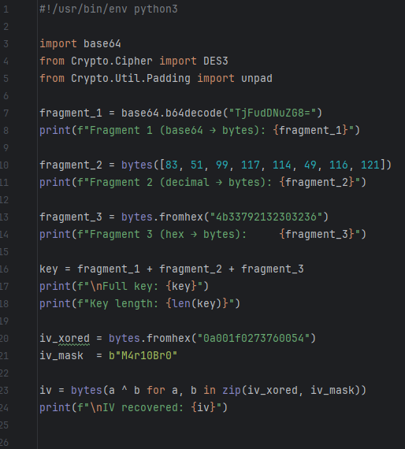

# [crypto] Nintendo 3DS

> **Категория:** `crypto`  
> **CTF:** KubSTU CTF 2026 Spring

---

Слушай, я всё не могу запомнить название алгоритма, но что-то очень похожее на Nintendo 3DS, помоги разобраться что там вообще было написано^^
Формат флага KubSTU{} 

[output.txt](./files/output.txt)

---

Смотрим текстовик и получаем входные данные, режим и паддинг, а из названия понимаем что это Triple DES

Для решения соберём ключ(Ключ разбит на 3 фрагмента в разных кодировках нужно собрать) с вектором(IV зашифрован XOR с маской нужно восстановить) и попробуем расшифровать

Всех данных должно хватить для решения

 

 

[solve.py](./files/solve.py)

Флаг: KubSTU{3d3s_n1nt3nd0_cbc_m0d3_n07_h4rd_3n0ugh}