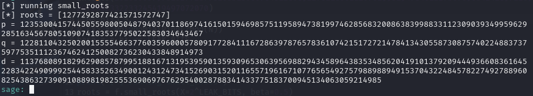
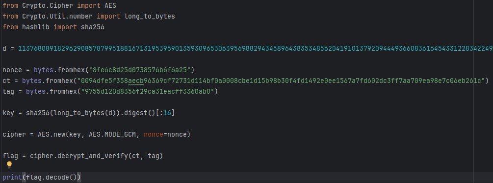
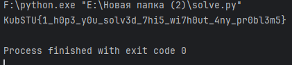

# [crypto] Not enough part 1

> **Категория:** `crypto`  
> **CTF:** KubSTU CTF 2026 Spring

---

Во время дампа системы часть параметров оказалась повреждена: от  p сохранились только часть бит,  последние 72 бита были потеряны. Затем из восстановленных параметров был получен ключ путём хеширования секрета(ещё уцелело это, по-моему, AES-GCM?)
Формат флага KubSTU{}  

[output.txt](./files/output.txt)

---

Перед нами RSA-схема: даны N, e и шифртекст. Сразу бросилось в глаза, что вместо полного простого числа p выдан только его префикс p_hi. Из условия следует, что были потеряны последние 72 бита p, то есть само число можно представить в виде p = p_hi · 2^72 + x, где неизвестное x — сравнительно маленькое.

В Sage был построен многочлен по модулю N, после чего с помощью small_roots() удалось восстановить недостающую часть p. Когда простое число нашлось, осталось вычислить второе простое q = N / p, затем восстановить функцию Эйлера phi = (p - 1)(q - 1) и найти закрытую экспоненту d = e^{-1} mod phi.  

 

 

[solve.sage](./files/solve.sage)

RSA здесь используется только как промежуточный этап. Из d через sha256(long_to_bytes(d)) (из условия) получался ключ для AES-GCM, которым и был зашифрован флаг. После восстановления d оставалось только вычислить ключ, инициализировать AES-GCM с указанными nonce, ciphertext и tag, и получить исходное сообщение.  

 

 

[solve.py](./files/solve.py)

Флаг: KubSTU{1_h0p3_y0u_solv3d_7hi5_wi7h0ut_4ny_pr0bl3m5}

