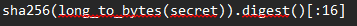
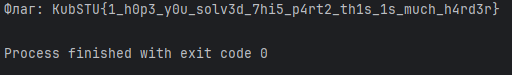

# [crypto] Not enough part 2

> **Категория:** `crypto`  
> **CTF:** KubSTU CTF 2026 Spring

---

Во время аварийного gвосстановления системы были сохранены лишь фрагменты двух ***-ключей. От каждого простого числа уцелели толькоc старшие биты, а младшие были ??????. После восстановления закрытых параметров из них был сформирован мастер-секрет, который затем mчерез KDF был превращён в ключ для чего-то.
Формат флага KubSTU{} 

Подсказка 1:  Присмотрись внимательнее, вдруг что-то ещё уцелело.

[output.txt](./files/output.txt)

---

Итак, это вторая часть задания, сразу читаем описание и сравниваем его с первой частью. Понимаем, что это усложнённая версия RSA+AES-GCM
(подтверждение именно этого режима работы находим также в описании: g-восстановления, c-только, m-через)

Заглянем в текстовик, там лежат все данные, которые нужны нам для начала восстановления( количество утерянных битов спряталось в sys info -это 72 для первого и 80 для второго)

 

Напишем скрипт для sage, который восстановит на p1 и p2  с помощью метода Копперсмита  

 

[solve.sage](./files/solve.sage)

 

Дальше, зная p1 и p2, находим q, phi и d. После пробуем собрать ключ для AES-GCM, зная как он построен(кстати, вот очередная подсказка, тут может снова немного прибегнем к первой части задания^^)

 

^^

 

Ну вот, теперь зная вообще всё, напишем финальный скрипт

 

[solve.py](./files/solve.py)

 

Задание немного сложнее, чем первая часть, но всё также решаемо

Флаг: KubSTU{1_h0p3_y0u_solv3d_7hi5_p4rt2_th1s_1s_much_h4rd3r}