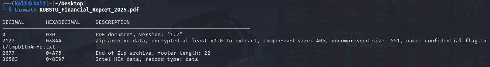

# [forensics] Is the report in English?

> **Категория:** `forensics`  
> **CTF:** KubSTU CTF 2026 Spring

<details>
<summary>📎 Файлы к заданию</summary>

| Файл | Тип |
|------|-----|
| [task.py](./files/img_3.py) | `py` |
| [KUBSTU_Financial_Report_2025.pdf](./files/img_4.pdf) | `application/pdf` |

</details>

---

 На почту пришел странный файл, финансовый отчет, да еще и на английском.

Используя команду binwalk можно найти встроенный архив, пароль к нему имеется при открытии самого документа или при анализе командой strings. В архиве фейк флаг и смешнявка.
Анализируя strings можно увидеть кучу base64 строк, нужно собрать скрипт, который извлечет все строки и декодирует их и мы получим действенный флаг.



## 🚩 Флаг

```
KubSTU{PDF_M3t4d4t4_F0r3ns1cs_4dv4nc3d_Ch4ll3ng3_2025_S3cur3_Emb3dd3d_F1l3_3ncrypt10n_Pr0t0c0l}
```
