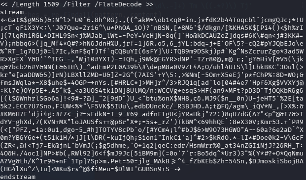
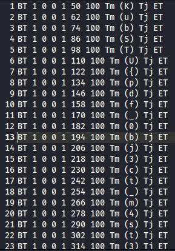

# [forensics] Mutant

> **Категория:** `forensics`  
> **CTF:** KubSTU CTF 2026 Spring

---

## Легенда

Поздравляю! Вы поступили в политех на информационную безопасность. Вам выдали образовательный материал. Завтра экзамен, удачи.

Сложность: Легкая

 

[crypt.pdf](./files/crypt.pdf)

## Суть задачи

Внутри PDF файла есть закодированные и запакованные данные, внутри флаг.

## Структура

Открытое содержимое PDF - бесполезный текст в рамках решения задачи. Анализ strings нам даст

 

А также


 


```javascript
/Contents [4 0 R 5 0 R]
```

Это означает, что страница состоит из двух потоков контента объекта 4 и объекта 5. Наличие двух потоков подозрительно.  Объект 5 собственно и является закодированными или зашифрованными данными.

Сам поток начинается с <\~ и заканчивается \~>, а это характерно для кодировки ASCII85. Мало того наличие /Filter /FlateDecode говорит о том, что данные сначала были сжаты, а затем закодированы.

В итоге, нужно собрать скрипт, который ивзлечет данные между stream и endstream, 

## Решение

Так как данные закодированы и упакованы сначала нужно раздекодировать. Кодировка ясна - ASCII85. Собираем скрипт для декодирования.


[exfil.py](./files/exfil.py)

Теперь распаковать данные. Создаем скрипт распаковки.


[raspak.py](./files/raspak.py)

Смотрим, что получилось


 

Уже видно прорисовку флага. На данном этапе можно вручную достать посимвольно флаг, либо снова сделать скрипт.

Флаг:  KubSTU{pdf_0bj3ct_m4st3r_v2}  