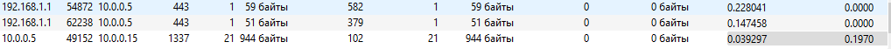
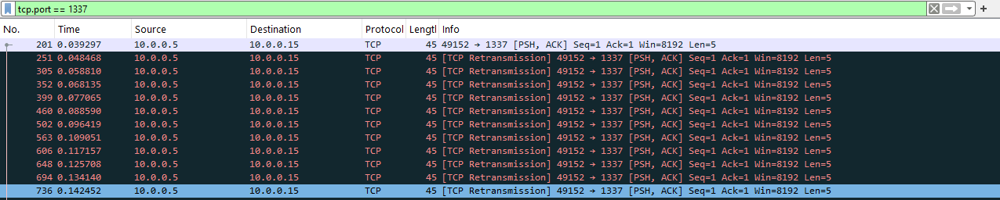

# [forensics] Ratte

> **Категория:** `forensics`  
> **CTF:** KubSTU CTF 2026 Spring

---

## Вы — специалист по расследованию инцидентов. В вашу компанию поступил дамп сетевого трафика (pcap-файл), перехваченный с одного из сегментов корпоративной сети в момент подозрительной активности. Проанализируйте, что же тут не так

Вы — специалист по расследованию инцидентов. В вашу компанию поступил дамп сетевого трафика (pcap-файл), перехваченный с одного из сегментов корпоративной сети в момент подозрительной активности.  

Вы — специалист по расследованию инцидентов. В вашу компанию поступил дамп сетевого трафика (pcap-файл), перехваченный с одного из сегментов корпоративной сети в момент подозрительной активности.  

И снова у нас подозрительный трафик в сети. Вроде все стандартно но есть то, что не вписывается.

[Ratte.pcap](./files/Ratte.pcap)

ыыыы

Открываем файл в Wireshark. Видим кучу пакетов: HTTP-запросы к Google, DNS-запросы, какой-то SSH и кучу TCP-пакетов. Всего более 1200 пакетов. Просматривать вручную — гиблое дело, нужно искать аномалии.  

### Открываем файл в Wireshark. Видим кучу пакетов: HTTP-запросы к Google, DNS-запросы, какой-то SSH и кучу TCP-пакетов. Всего более 1200 пакетов. Просматривать вручную — гиблое дело, нужно искать аномалии.  

## Структура

Открываем файл в Wireshark. Видим кучу пакетов: HTTP-запросы к Google, DNS-запросы, какой-то SSH и кучу TCP-пакетов. Всего более 1200 пакетов. Просматривать вручную — гиблое дело, нужно искать аномалии.  

##  Решение 

Statistics -> Conversations -> TCP. Видим странную активность:

 

 

Порт 1337, мало того, что он выделяется среди остальных портов, он имеет довольно большой объем. Применяем фильтр: tcp.port == 1337  

 

  Смотрим первый пакет данных от клиента (10.0.0.5) к серверу (10.0.0.15).Полезная нагрузка в HEX: de ad be ef 42. DEADBEEF — классический "магический" маркер начала сессии. А что за 42 в конце? Возможно, это какой-то ID или же XOR ключ. Запоминаем его: 0x42 

Смотрим следующие пакеты в этом же потоке. Они все начинаются с байта 0xcc.Пример одного из пакетов: cc 1a 02 09 37.Разбираем по байтам:

1.cc - похоже на маркер начала кадра (Magic Byte).

2.1a - какой-то случайный байт (может быть ID пакета или мусор).

3.02 - а вот это похоже на длину данных. После него как раз идут 2 байта: 09 37.

Пробуем применить наш ключ 0x42 к этим байтам:

•0x09 ^ 0x42 = 0x4b ('K')

•0x37 ^ 0x42 = 0x75 ('u')

Получилось “Ku” Это начало флага KubSTU. Значит, теория верна: флаг разбит на части по 2 символа, зашифрован XOR с ключом 0x42 и спрятан в пакетах, начинающихся с 0xcc.

 Создаем скрипт который все извлечет и декодирует.

[rat.py](./files/rat.py)

Флаг: KubSTU{n0_m0r3_gr3pp1ng_1n_th3_d4rk_v2}  