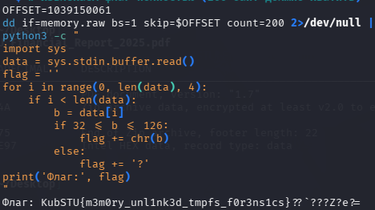

# [forensics] Vanilla raw

> **Категория:** `forensics`  
> **CTF:** KubSTU CTF 2026 Spring

---

Нам передали дамп оперативной памяти, но почему то мы не можем его проанализировать, помоги нам.

[memory.rar](./files/memory.rar)

Анализ strings нам ничего не дает. Grep по маске также ничего не дает. Хотя дамп и на 2 гб значит что то должно быть.
При анализе энтропии и шестнадцатеричного дампа видим:


 


 

Делаем вывод, что большее кол-во памяти нули, но есть и ненулевые значения. Ищем их позицию. Крафтим скрипт, который среагирует на первый ненулевой байт.


 

Исследуем окружение

 

Нам это ничего не дает с первого взгляда, но можно заметить возможное смещение на 4 байта. Нам известна маска KubSTU{…}. Искать по маске судя по всему смысла не имеет и надо смотреть символьно. Смотрим символ K.

 

Видим, что данный символ присутствует на нескольких смещениях, просмотрим все и видим как на определенном смещении прорисовывается маска флага

 

Создаем скрипт, который извлечет флаг полностью


 

Флаг: 

```javascript
KubSTU{m3m0ry_unl1nk3d_tmpfs_f0r3ns1cs}
```


