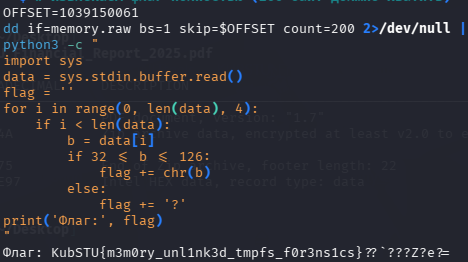

# [forensics] Vanilla raw

> **Категория:** `forensics`  
> **CTF:** KubSTU CTF 2026 Spring

<details>
<summary>📎 Файлы к заданию</summary>

| Файл | Тип |
|------|-----|
| [memory.rar](./files/img_11.rar) | `rar` |

</details>

---

Нам передали дамп оперативной памяти, но почему то мы не можем его проанализировать, помоги нам.
Анализ strings нам ничего не дает. Grep по маске также ничего не дает. Хотя дамп и на 2 гб значит что то должно быть.При анализе энтропии и шестнадцатеричного дампа видим:



Делаем вывод, что большее кол-во памяти нули, но есть и ненулевые значения. Ищем их позицию. Крафтим скрипт, который среагирует на первый ненулевой байт.

## Исследуем окружение

Нам это ничего не дает с первого взгляда, но можно заметить возможное смещение на 4 байта. Нам известна маска KubSTU{…}. Искать по маске судя по всему смысла не имеет и надо смотреть символьно. Смотрим символ K.
Видим, что данный символ присутствует на нескольких смещениях, просмотрим все и видим как на определенном смещении прорисовывается маска флага
Создаем скрипт, который извлечет флаг полностью

## 🚩 Флаг

```
KubSTU{m3m0ry_unl1nk3d_tmpfs_f0r3ns1cs}
```
