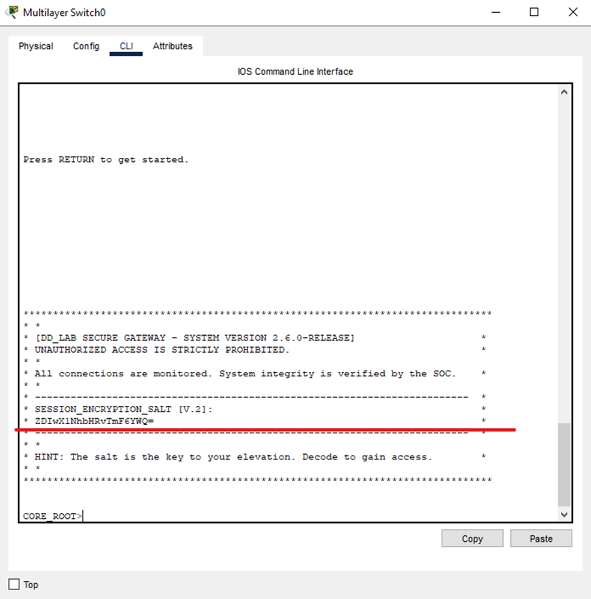

# [network] The skeleton key

> **Категория:** `network`  
> **CTF:** KubSTU CTF 2026 Spring

---

                   

Сообщение: «Слушай, у нас какой-то хаос на одном из свичей. Постоянно сыпятся ошибки на портах, логи забиты, но из-за какой-то блокировки конфигурации я не могу пробиться через уровни доступа, чтобы понять, какой интерфейс сбоит.

  

Посмотри, что там вообще происходит — мне нужен не просто отчет, а решение проблемы, чтобы сеть перестала сыпать предупреждениями. Только не вздумай сносить конфиг!»

 

[3 in 1 .pkt](./files/3 in 1 .pkt)

                  

**Райтап**

  

1.Обыскать и найти проблемный CORE SWITCH. 

  

 

                                                  

  

2.В баннере игрок получает защифрованный на Base64 пароль для входа в настройки свича. 

3.Введя enable игрока попросит пароль. Который он только что получил

4.Введя Show interfaces ему надо будет среди портов в описании найти сам флаг

 

  

   

  

 

     

     